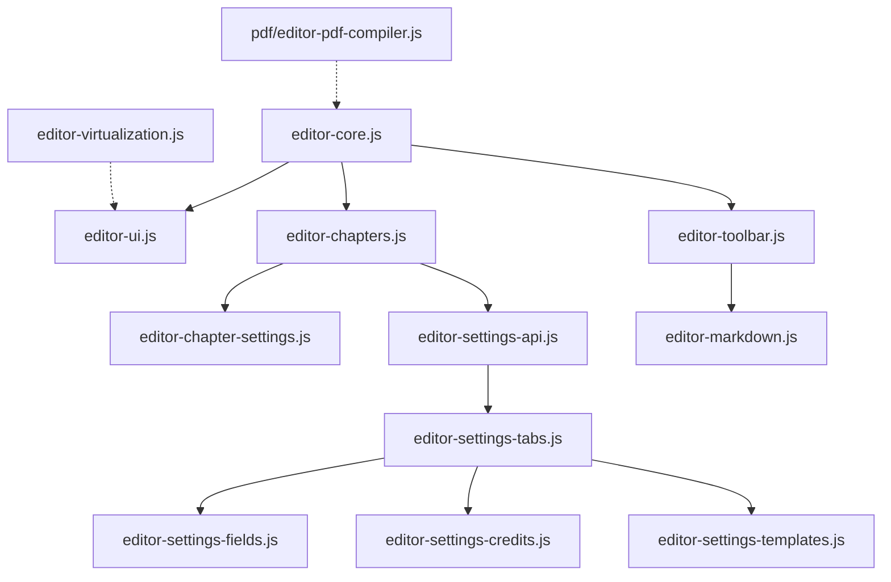

# Arquitectura del Content Editor (`assets/js/editor/`)

Este directorio contiene la arquitectura modular en JavaScript vanilla que impulsa el editor interactivo de libros de **Almaden Bookster**. Diseñado bajo un estricto principio de modularidad y bajo la regla de que ningún archivo individual debe exceder las **500 líneas de código**, este sistema orquesta la interfaz del usuario, la toolbar de formato, el motor de parsing de Markdown, la sincronización de ajustes y la compilación/paginación dinámica del PDF mediante Paged.js.

## Actualizacion reciente: PDF editable en modo Dividido

La vista `Dividido` ya no usa un visor separado para el PDF. Ahora el contenido visible de Paged.js se reutiliza como superficie editable real, de modo que:

- el usuario puede hacer clic directamente sobre el texto del PDF y editarlo inline;
- la toolbar aplica formatos sobre la misma seleccion visual que se ve en pantalla;
- el contenido se serializa de vuelta al estado raw manteniendo marks como `bold`, `italic`, alineacion y etiquetas semanticas como `<foreign lang="la">`;
- el re-render de Paged.js queda bloqueado mientras el usuario esta editando, para no perder cambios por recompilacion;
- el guardado sincroniza primero la superficie visual y luego persiste el HTML resultante en la base de datos.

Los archivos que participan en este flujo son:

- [editor-visual-editor.js](file:///Users/nicolaspavez/Local%20Sites/almaden/app/public/wp-content/plugins/almaden-bookster/assets/js/editor/editor-visual-editor.js)
- [editor-visual-session.js](file:///Users/nicolaspavez/Local%20Sites/almaden/app/public/wp-content/plugins/almaden-bookster/assets/js/editor/editor-visual-session.js)
- [editor-chapters.js](file:///Users/nicolaspavez/Local%20Sites/almaden/app/public/wp-content/plugins/almaden-bookster/assets/js/editor/editor-chapters.js)
- [editor-pdf-html.js](file:///Users/nicolaspavez/Local%20Sites/almaden/app/public/wp-content/plugins/almaden-bookster/assets/js/pdf/core/editor-pdf-html.js)
- [editor-style.css](file:///Users/nicolaspavez/Local%20Sites/almaden/app/public/wp-content/plugins/almaden-bookster/assets/css/editor-style.css)

---

## Flujo General y Arquitectura

---

## Módulos y Responsabilidades

### 1. Inicialización y Estado Central

*   **[editor-core.js](file:///Users/nicolaspavez/Local%20Sites/almaden/app/public/wp-content/plugins/almaden-bookster/assets/js/editor/editor-core.js)**
    *   **Responsabilidad**: Punto de entrada de la aplicación, configuración de observadores del editor, registro de cursor y bindings iniciales.
    *   **Variables Globales**:
        *   `window.editorLastSelection`: Almacena el inicio y fin de la selección activa en el textarea del editor.
        *   `window.currentPreviewMode`: `'active'` (previsualizar solo el capítulo actual) o `'full'` (previsualizar el libro entero).
    *   **Funciones Clave**:
        *   [trackEditorSelection](file:///Users/nicolaspavez/Local%20Sites/almaden/app/public/wp-content/plugins/almaden-bookster/assets/js/editor/editor-core.js#L5): Captura la posición exacta de la selección del cursor en el textarea del editor.
        *   [initEventListeners](file:///Users/nicolaspavez/Local%20Sites/almaden/app/public/wp-content/plugins/almaden-bookster/assets/js/editor/editor-core.js#L104): Bindea escuchas a entradas de texto, redimensionamiento de pantalla y clicks de autoguardado manual.

*   **[editor-ui.js](file:///Users/nicolaspavez/Local%20Sites/almaden/app/public/wp-content/plugins/almaden-bookster/assets/js/editor/editor-ui.js)**
    *   **Responsabilidad**: Controla el diseño visual del workspace (modos de pantalla dividida, solo editor o solo visor PDF), transiciones de tema y la calibración métrica en pantalla.
    *   **Funciones Clave**:
        *   [setViewMode](file:///Users/nicolaspavez/Local%20Sites/almaden/app/public/wp-content/plugins/almaden-bookster/assets/js/editor/editor-ui.js#L4): Conmuta clases CSS para cambiar la vista (`split`, `edit`, `preview`).
        *   [changeTheme](file:///Users/nicolaspavez/Local%20Sites/almaden/app/public/wp-content/plugins/almaden-bookster/assets/js/editor/editor-ui.js#L39): Cambia el esquema visual global (`light`, `sepia`, `dark`).
        *   [toggleSpreadView](file:///Users/nicolaspavez/Local%20Sites/almaden/app/public/wp-content/plugins/almaden-bookster/assets/js/editor/editor-ui.js#L78): Alterna la visualización de una sola página con la de doble página encarada (spread layout).
        *   [renderRuler](file:///Users/nicolaspavez/Local%20Sites/almaden/app/public/wp-content/plugins/almaden-bookster/assets/js/editor/editor-ui.js#L174): Dibuja y calibra la regla física milimétrica. En base al modo de vista (spread o single page), calcula el punto cero exactamente alineado con el lomo central divisor de Paged.js.
        *   [showToast](file:///Users/nicolaspavez/Local%20Sites/almaden/app/public/wp-content/plugins/almaden-bookster/assets/js/editor/editor-ui.js#L109): Dispara notificaciones flotantes temporales con animaciones.

---

### 2. Gestión de Capítulos y Persistencia

*   **[editor-chapters.js](file:///Users/nicolaspavez/Local%20Sites/almaden/app/public/wp-content/plugins/almaden-bookster/assets/js/editor/editor-chapters.js)**
    *   **Responsabilidad**: Operaciones CRUD sobre los capítulos, ordenación Drag and Drop en el panel lateral, cálculo optimizado de palabras y el mecanismo asíncrono de paginación de fondo.
    *   **Funciones Clave**:
        *   [renderSidebar](file:///Users/nicolaspavez/Local%20Sites/almaden/app/public/wp-content/plugins/almaden-bookster/assets/js/editor/editor-chapters.js#L49): Dibuja dinámicamente la lista de capítulos e inicializa los controladores HTML5 `dragstart`, `dragenter`, `dragleave` y `drop` para reordenación visual.
        *   [updateWordCounts](file:///Users/nicolaspavez/Local%20Sites/almaden/app/public/wp-content/plugins/almaden-bookster/assets/js/editor/editor-chapters.js#L10): Ejecuta recuentos de palabras aplicando caché inteligente sobre los capítulos inactivos para evitar Layout Thrashing.
        *   [loadActiveChapter](file:///Users/nicolaspavez/Local%20Sites/almaden/app/public/wp-content/plugins/almaden-bookster/assets/js/editor/editor-chapters.js#L173): Carga el contenido en el editor. Configura el área de texto como solo lectura para el Índice (generado automáticamente) y muestra inputs condicionales si es la página de Créditos.
        *   [saveStateToLocalStorage](file:///Users/nicolaspavez/Local%20Sites/almaden/app/public/wp-content/plugins/almaden-bookster/assets/js/editor/editor-chapters.js#L312): Mecanismo de autoguardado (debounced a 15 segundos o ejecución inmediata). Realiza peticiones AJAX a WordPress y actualiza IDs temporales locales con los asignados por la base de datos tras persistirse.
        *   `window.calculateAllPagesBackground`: Ejecuta una compilación en segundo plano instanciando un contenedor fantasma `#dummy-pdf-scroller` invisible para paginar la totalidad del libro y actualizar las posiciones y recuentos de página reales sin interrumpir la edición del usuario.

*   **[editor-chapter-settings.js](file:///Users/nicolaspavez/Local%20Sites/almaden/app/public/wp-content/plugins/almaden-bookster/assets/js/editor/editor-chapter-settings.js)**
    *   **Responsabilidad**: Lógica y renderizado del modal de ajustes a nivel de capítulo individual (paridad de inicio, subtítulos, letra capitular, desactivación de guionado e imágenes de paridad).
    *   **Funciones Clave**:
        *   [openChapterSettingsModal](file:///Users/nicolaspavez/Local%20Sites/almaden/app/public/wp-content/plugins/almaden-bookster/assets/js/editor/editor-chapter-settings.js#L6): Prepara el modal, poblando los selectores de tipografía y visibilidades según el tipo de capítulo (Normal, Índice o Créditos).
        *   [saveChapterSettings](file:///Users/nicolaspavez/Local%20Sites/almaden/app/public/wp-content/plugins/almaden-bookster/assets/js/editor/editor-chapter-settings.js#L189): Extrae los valores del formulario (normalizando decimales ingresados con comas a puntos con `.replace(',', '.')`) y aplica las configuraciones al objeto del capítulo activo en `bookState.chapters`.

---

### 3. Barra de Herramientas y Markdown

*   **[editor-toolbar.js](file:///Users/nicolaspavez/Local%20Sites/almaden/app/public/wp-content/plugins/almaden-bookster/assets/js/editor/editor-toolbar.js)**
    *   **Responsabilidad**: Formateo de texto inline, inserción de marcadores y manejo de los diálogos de carga de la biblioteca multimedia (`wp.media`) de WordPress.
    *   **Funciones Clave**:
        *   [wrapText](file:///Users/nicolaspavez/Local%20Sites/almaden/app/public/wp-content/plugins/almaden-bookster/assets/js/editor/editor-toolbar.js#L4): Envuelve la selección o el cursor con prefijos y sufijos Markdown (ej. `**` para negritas), restaurando automáticamente el foco al editor.
        *   [addPrefix](file:///Users/nicolaspavez/Local%20Sites/almaden/app/public/wp-content/plugins/almaden-bookster/assets/js/editor/editor-toolbar.js#L35): Inserta prefijos a nivel de inicio de línea (listas, cabeceras, blockquotes).
        *   [openMediaUploader](file:///Users/nicolaspavez/Local%20Sites/almaden/app/public/wp-content/plugins/almaden-bookster/assets/js/editor/editor-toolbar.js#L57) / [openParityImageUploader](file:///Users/nicolaspavez/Local%20Sites/almaden/app/public/wp-content/plugins/almaden-bookster/assets/js/editor/editor-toolbar.js#L92): Instancia la interfaz de WordPress Media para insertar etiquetas de imagen personalizadas en el cursor o asociar imágenes de paridad al capítulo actual.

*   **[editor-markdown.js](file:///Users/nicolaspavez/Local%20Sites/almaden/app/public/wp-content/plugins/almaden-bookster/assets/js/editor/editor-markdown.js)**
    *   **Responsabilidad**: Compilador de alto rendimiento para convertir sintaxis Markdown a HTML estructurado y semántico compatible con el motor de Paged.js.
    *   **Mecanismo de Parseo**:
        1. **Preservación Multimedia**: Extrae etiquetas nativas ``, bloques `[html]` y shortcodes estructurales (`[box]`, `[align]`, etc.) mediante expresiones regulares antes de cualquier escape, inyectando marcadores de posición temporales (ej. `%%IMG_PLACEHOLDER_N%%`).
        2. **Escape Seguro**: Escapa caracteres reservados HTML del cuerpo de texto.
        3. **Formateo Inline**: Compila negritas (`**`), cursivas (`*`), subrayados (`<u>`) y shortcodes de traducción inline.
        4. **Formateo de Bloque**: Analiza línea por línea para encapsular elementos en `<h1>`, `<h2>`, `<blockquote>`, `<ul>/<li>` o `
`.
        5. **Restauración de Bloques**: Restaura los placeholders a sus posiciones originales asegurándose de que el contenido HTML puro o los contenedores estructurales no queden rodeados erróneamente por etiquetas `
`.
        6. **Notas al Pie**: Resuelve definiciones inline del tipo `[^ref]` usando la etiqueta como referencia interna y genera la numeración visible de forma automática en el orden de aparición.

---

### 4. Configuración Global del Libro

*   **[editor-settings-api.js](file:///Users/nicolaspavez/Local%20Sites/almaden/app/public/wp-content/plugins/almaden-bookster/assets/js/editor/editor-settings-api.js)**
    *   **Responsabilidad**: Serialización y validación profunda de la configuración del libro y sincronización con el servidor mediante peticiones AJAX.
    *   **Funciones Clave**:
        *   `window.savePDFSettings`: Recopila todos los campos del modal de ajustes, normaliza meticulosamente las comas decimales a puntos decimales para evitar fallas en el cálculo de dimensiones CSS del compilador PDF, y realiza una llamada al endpoint `almaden_save_book_settings`.

*   **[editor-settings-tabs.js](file:///Users/nicolaspavez/Local%20Sites/almaden/app/public/wp-content/plugins/almaden-bookster/assets/js/editor/editor-settings-tabs.js)**
    *   **Responsabilidad**: Administra la navegación interna de pestañas del modal de configuración general (Página, Tipografía, Cabecera/Pie, Capítulos, Créditos y Plantillas) y la carga de valores en los inputs.
    *   **Funciones Clave**:
        *   `window.populateSettingsForm`: Lee la configuración de `bookState.settings` e inyecta los valores actuales en el formulario del modal, inicializando fallbacks métricos seguros si no se encuentran valores definidos.

*   **[editor-settings-fields.js](file:///Users/nicolaspavez/Local%20Sites/almaden/app/public/wp-content/plugins/almaden-bookster/assets/js/editor/editor-settings-fields.js)**
    *   **Responsabilidad**: Reglas y visibilidades condicionales en los campos de formulario del modal de configuración general.
    *   **Funciones Clave**:
        *   `toggleCustomPageFields`, `toggleCustomHeaderFields`, `updateUnitFields`: Modifican dinámicamente visibilidades de campos de tamaño de página, etiquetas de unidades métricas (`cm` o `in`) e inputs de texto personalizado para cabeceras y pies de página.

*   **[editor-settings-credits.js](file:///Users/nicolaspavez/Local%20Sites/almaden/app/public/wp-content/plugins/almaden-bookster/assets/js/editor/editor-settings-credits.js)** (y sus submódulos)
    *   **Responsabilidad**: Lógica modularizada para la creación dinámica, persistencia de estado y serialización del modal de créditos (roles, colaboradores y logo). Dividido en submódulos para asegurar la mantenibilidad y respetar el límite de líneas:
        *   `-constants.js`: Opciones predefinidas, diccionarios y fallbacks tipográficos.
        *   `-utils.js`: Funciones de normalización de datos y parsing de estilos.
        *   `-config.js`: Lógica para rellenar vacíos con configuraciones por defecto y mapeos legacy.
        *   `-state.js`: Aislamiento del ciclo de persistencia AJAX (`creditsForceRemoteSave`, `creditsPersistRemoteConfig`).
        *   `-ui.js`: Únicamente constructores de strings HTML (Rows, Tabs, Modals).
        *   `-events.js`: Bindings puros de eventos del DOM en el namespace de créditos.
    *   **Funciones Clave**:
        *   `creditsPopulateForm` y `creditsBindRootEvents` (en el archivo principal): Punto de entrada y orquestación del subsistema de créditos.

*   **[editor-settings-templates.js](file:///Users/nicolaspavez/Local%20Sites/almaden/app/public/wp-content/plugins/almaden-bookster/assets/js/editor/editor-settings-templates.js)**
    *   **Responsabilidad**: Permite a los usuarios guardar configuraciones globales actuales como presets de estilo ("plantillas") e importarlas rápidamente.
    *   **Funciones Clave**:
        *   [loadSettingsTemplates](file:///Users/nicolaspavez/Local%20Sites/almaden/app/public/wp-content/plugins/almaden-bookster/assets/js/editor/editor-settings-templates.js#L4): Solicita presets de formato persistidos en la base de datos de WordPress y los dibuja en el modal.
        *   [applySettingsTemplate](file:///Users/nicolaspavez/Local%20Sites/almaden/app/public/wp-content/plugins/almaden-bookster/assets/js/editor/editor-settings-templates.js#L68): Carga los valores de una plantilla preestablecida y simula eventos de interacción del usuario en cada input para actualizar el estado global.

---

### 5. Rendimiento y Virtualización

*   **[editor-virtualization.js](file:///Users/nicolaspavez/Local%20Sites/almaden/app/public/wp-content/plugins/almaden-bookster/assets/js/editor/editor-virtualization.js)**
    *   **Responsabilidad**: Rendimiento del scroll interactivo en el modo de previsualización completa del libro (`'full'`) mediante Virtualización del DOM.
    *   **Mecanismo**:
        *   Usa `IntersectionObserver` con un margen de renderizado (`rootMargin: '1500px 0px'`).
        *   Cuando una página del PDF renderizada por Paged.js sale de los límites de intersección, su contenido interno es guardado en caché y reemplazado en el DOM por un nodo ligero (`.virtual-placeholder`), liberando memoria de renderizado y logrando un rendimiento fluido del scroll sobre libros de cientos de páginas. Al reingresar al área visible, su contenido original es restaurado de inmediato.

---

## Ciclos de Vida y Arquitecturas Críticas

### A. Ciclo de Autoguardado e Intercambio de IDs AJAX
Cuando el usuario escribe en el editor:
1. Se calcula el recuento de palabras local y se actualiza el estado en memoria `bookState`.
2. Se activa un timer de autosave debounced a 15 segundos.
3. Si el guardado es manual o inmediato:
   * Si está en previsualización de capítulo individual, se invoca a `window.calculateAllPagesBackground()` que calcula silenciosamente las páginas totales reales del libro entero usando un visor temporal invisible `#dummy-pdf-scroller`.
   * Se recopila el total de páginas y se envía vía AJAX con los capítulos serializados.
   * La respuesta de base de datos devuelve una lista de correspondencia de IDs temporales (`cap-xxxx`) a los IDs definitivos autogenerados por la base de datos.
   * El estado del editor reemplaza los IDs viejos por los nuevos en tiempo real para evitar que se pierdan las imágenes de paridad o metadatos tras agregar capítulos nuevos.

### B. Flujo de Paridad y Página Izquierda en Blanco
El control de la alineación de páginas pares e impares al iniciar un capítulo utiliza un mecanismo de **Named Pages** de Paged.js sin reestructurar el árbol DOM de forma artificial:
1. El compilador en [editor-pdf-compiler.js](file:///Users/nicolaspavez/Local%20Sites/almaden/app/public/wp-content/plugins/almaden-bookster/assets/js/pdf/editor-pdf-compiler.js) inyecta una sección vacía para la imagen de paridad `.chapter-parity-section-${id}` antes de la sección de contenido principal `.chapter-section-${id}` si el capítulo está configurado para iniciar en página impar (`odd`).
2. Se inyecta un spacer invisible en la primera página (`.book-start-dummy-page`) para evitar que Paged.js ignore la directiva de salto de página `break-before: left` sobre el primer elemento del flujo de render.
3. El spacer se oculta usando posicionamiento absoluto offscreen (`position: absolute; left: -9999px; visibility: hidden; width: 0; height: 0;`) para que no altere la visualización interactiva ni cause errores de cálculo en el método `.getBoundingClientRect()` de Paged.js.
4. En [editor-pdf-styles-base.js](file:///Users/nicolaspavez/Local%20Sites/almaden/app/public/wp-content/plugins/almaden-bookster/assets/js/pdf/editor-pdf-styles-base.js), la sección de paridad se enlaza a un Named Page específico configurado con `break-before: left; break-after: page;` y la sección del capítulo a `break-before: right;`, garantizando que el inicio físico del capítulo comience de forma natural a la derecha (impar) y la imagen a la izquierda (par).

---

## Directrices para Desarrolladores

> [!IMPORTANT]
> **Límite de Código**: Cualquier refactorización o incorporación de características debe respetar la modularidad de archivos de este directorio. Bajo ninguna circunstancia se debe permitir que un archivo supere las **500 líneas**. Si es necesario, utiliza la estructura de subarchivos o crea utilidades compartidas.

> [!TIP]
> **Layout Thrashing**: Para evitar cuellos de botella y parpadeos en el editor durante los eventos de teclado (`input`), nunca midas dimensiones del DOM (`offsetHeight`, `offsetWidth`, etc.) de forma directa en los loops de recuento de palabras o procesamiento. Utiliza lecturas y cachés de tamaño almacenados en memoria como hace [editor-chapters.js](file:///Users/nicolaspavez/Local%20Sites/almaden/app/public/wp-content/plugins/almaden-bookster/assets/js/editor/editor-chapters.js).

> [!WARNING]
> **Localización Decimal**: Al recuperar números desde el DOM en configuraciones físicas (márgenes, paddings, bleeding), siempre ejecuta `.replace(',', '.')` antes de realizar cálculos o de enviar la petición AJAX. Varias instalaciones locales o de producción configuradas en español ingresan comas para los decimales, lo cual provoca cálculos fallidos en CSS (ej. `2,5cm` es ignorado por Paged.js, mientras que `2.5cm` funciona correctamente).

* editor-visual-selection.js
