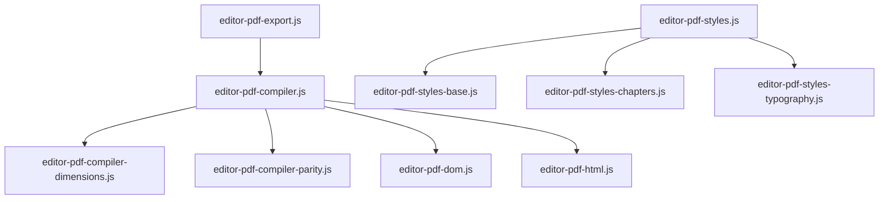

# Motor de Renderizado PDF (`assets/js/pdf/`)

Este directorio alberga la arquitectura del motor de maquetación, paginación y exportación a PDF de **Almaden Bookster**. Diseñado sobre la API y el ciclo de vida de **Paged.js**, este motor transforma contenido HTML continuo en pliegos de páginas listos para impresión física, respetando estándares del W3C Paged Media.

En cumplimiento estricto de las directrices del proyecto (**límite de 500 líneas por archivo**), las hojas de estilo y el compilador están divididos en módulos independientes y altamente cohesivos.

---

## Módulos y Responsabilidades

### 1. Compilación y Flujo de Paginación

*   **[editor-pdf-compiler.js](file:///Users/nicolasibarra/Local%20Sites/ada/app/public/wp-content/plugins/almaden-bookster/assets/js/pdf/editor-pdf-compiler.js)**
    *   **Responsabilidad**: Orquestador central del flujo. Toma el estado global (`bookState`), concatena el contenido del libro o capítulo activo y lanza la instancia de `Paged.Previewer` para procesar el layout.
    *   **Funciones Clave**:
        *   [compilePDFPreview](file:///Users/nicolasibarra/Local%20Sites/ada/app/public/wp-content/plugins/almaden-bookster/assets/js/pdf/editor-pdf-compiler.js#L312): Función encolada y libre de condiciones de carrera para programar renderizaciones secuenciales del visor.
        *   [_compilePDFPreviewInternal](file:///Users/nicolasibarra/Local%20Sites/ada/app/public/wp-content/plugins/almaden-bookster/assets/js/pdf/editor-pdf-compiler.js#L8): Ejecuta la inicialización de buffers, generación de HTML continuo y mapeo de metadatos de inicio de capítulos.

*   **[editor-pdf-compiler-dimensions.js](file:///Users/nicolasibarra/Local%20Sites/ada/app/public/wp-content/plugins/almaden-bookster/assets/js/pdf/editor-pdf-compiler-dimensions.js)**
    *   **Responsabilidad**: Lógica de conversión de medidas del libro. Traduce tamaños estándar (A4, Letter, Custom) y márgenes desde la unidad de ajuste (`cm` o `in`) a dimensiones físicas de pantalla en píxeles.
    *   **Funciones Clave**:
        *   [calculatePageDimensions](file:///Users/nicolasibarra/Local%20Sites/ada/app/public/wp-content/plugins/almaden-bookster/assets/js/pdf/editor-pdf-compiler-dimensions.js#L7): Retorna anchos, altos, factores de conversión y la altura máxima disponible de contenido por página.

*   **[editor-pdf-compiler-parity.js](file:///Users/nicolasibarra/Local%20Sites/ada/app/public/wp-content/plugins/almaden-bookster/assets/js/pdf/editor-pdf-compiler-parity.js)**
    *   **Responsabilidad**: Controla el inicio correcto en página par/impar para flujos de impresión.
    *   **Funciones Clave**:
        *   [handleChapterParity](file:///Users/nicolasibarra/Local%20Sites/ada/app/public/wp-content/plugins/almaden-bookster/assets/js/pdf/editor-pdf-compiler-parity.js#L7): Inserta páginas en blanco lógicas si el capítulo siguiente requiere paridad (ej: iniciar en página derecha/impar).

---

### 2. Estructura de DOM y HTML

*   **[editor-pdf-dom.js](file:///Users/nicolasibarra/Local%20Sites/ada/app/public/wp-content/plugins/almaden-bookster/assets/js/pdf/editor-pdf-dom.js)**
    *   **Responsabilidad**: Helpers para crear páginas físicas virtuales en el DOM y encapsular la estructura visual de cada hoja.
    *   **Funciones Clave**:
        *   [createNewPageElement](file:///Users/nicolasibarra/Local%20Sites/ada/app/public/wp-content/plugins/almaden-bookster/assets/js/pdf/editor-pdf-dom.js#L7): Construye la envoltura HTML de cada página (cajas de cabecera, pie y clases de paridad).

*   **[editor-pdf-html.js](file:///Users/nicolasibarra/Local%20Sites/ada/app/public/wp-content/plugins/almaden-bookster/assets/js/pdf/editor-pdf-html.js)**
    *   **Responsabilidad**: Procesamiento del Markdown a nivel de estructura de página. Prepara bloques de capítulos, genera el listado dinámico del Índice (TOC), renderiza las secciones de Créditos y aplica letras capitales y prefijos de capítulo.
    *   **Funciones Clave**:
        *   [buildChapterHTML](file:///Users/nicolasibarra/Local%20Sites/ada/app/public/wp-content/plugins/almaden-bookster/assets/js/pdf/editor-pdf-html.js#L7): Construye y compila el contenido HTML enriquecido para el capítulo seleccionado.
        *   [updateTOCPagesInCache](file:///Users/nicolasibarra/Local%20Sites/ada/app/public/wp-content/plugins/almaden-bookster/assets/js/pdf/editor-pdf-html.js#L234): Mapea y reemplaza las páginas correspondientes en la tabla de contenidos interactiva.

---

### 3. Generación y Combinación de Estilos CSS

*   **[editor-pdf-styles.js](file:///Users/nicolasibarra/Local%20Sites/ada/app/public/wp-content/plugins/almaden-bookster/assets/js/pdf/editor-pdf-styles.js)**
    *   **Responsabilidad**: Inyección reactiva del CSS dinámico en la cabecera de la aplicación.
    *   **Funciones Clave**:
        *   [applyDynamicPDFStyles](file:///Users/nicolasibarra/Local%20Sites/ada/app/public/wp-content/plugins/almaden-bookster/assets/js/pdf/editor-pdf-styles.js#L9): Concentrador que recopila los fragmentos base, tipográficos y de capítulos y los consolida en el elemento `#dynamic-pdf-settings`.

*   **[editor-pdf-styles-base.js](file:///Users/nicolasibarra/Local%20Sites/ada/app/public/wp-content/plugins/almaden-bookster/assets/js/pdf/editor-pdf-styles-base.js)**
    *   **Responsabilidad**: Define las reglas `@page`, dimensiones de caja, márgenes simétricos/asimétricos (`:left`/`:right`), estilos globales de headers/footers y los hacks de ocultamiento de páginas vacías iniciales para vistas de spreads en pantalla.
    *   **Funciones Clave**:
        *   [getPDFStylesBase](file:///Users/nicolasibarra/Local%20Sites/ada/app/public/wp-content/plugins/almaden-bookster/assets/js/pdf/editor-pdf-styles-base.js#L58): Retorna la estructura principal de maquetación física CSS.
        *   [getHeaderFooterCSS](file:///Users/nicolasibarra/Local%20Sites/ada/app/public/wp-content/plugins/almaden-bookster/assets/js/pdf/editor-pdf-styles-base.js#L525): Genera las directivas W3C de asignación de contenido de cabecera y pie por página.

*   **[editor-pdf-styles-chapters.js](file:///Users/nicolasibarra/Local%20Sites/ada/app/public/wp-content/plugins/almaden-bookster/assets/js/pdf/editor-pdf-styles-chapters.js)**
    *   **Responsabilidad**: *[NUEVO]* Genera de forma aislada las reglas de Named Pages y paridad exclusivas para cada capítulo (permitiendo saltos de página inteligentes e inyección de imágenes de fondo personalizadas de cortesía).

*   **[editor-pdf-styles-typography.js](file:///Users/nicolasibarra/Local%20Sites/ada/app/public/wp-content/plugins/almaden-bookster/assets/js/pdf/editor-pdf-styles-typography.js)**
    *   **Responsabilidad**: Estilizado de texto, espaciados de párrafo, tipografías h1/h2/h3, reglas de guionado (`hyphens: auto`), diseño del Índice (incluyendo guías de puntos de lomo en CSS Grid) y estilos tipográficos especiales para Créditos.
    *   **Funciones Clave**:
        *   [getPDFStylesTypography](file:///Users/nicolasibarra/Local%20Sites/ada/app/public/wp-content/plugins/almaden-bookster/assets/js/pdf/editor-pdf-styles-typography.js#L6): Retorna la colección de estilos tipográficos del cuerpo del texto.

---

### 4. Exportación e Impresión

*   **[editor-pdf-export.js](file:///Users/nicolasibarra/Local%20Sites/ada/app/public/wp-content/plugins/almaden-bookster/assets/js/pdf/editor-pdf-export.js)**
    *   **Responsabilidad**: Gestiona la llamada nativa a `window.print()`.
    *   **Funciones Clave**:
        *   [triggerPrint](file:///Users/nicolasibarra/Local%20Sites/ada/app/public/wp-content/plugins/almaden-bookster/assets/js/pdf/editor-pdf-export.js#L25): Detiene la virtualización de scroll, forzar pre-compilación del libro completo, inyecta hojas de estilo específicas de medios de impresión (`@media print` para ocultar paneles laterales y layouts del editor) y abre el panel de exportación PDF del navegador de forma segura.

---

### 5. Archivos Inactivos o Deprecados

*   **`editor-pdf-pagination.js`**: *[DEPRECADO]* Antiguo algoritmo procedimental de medición de píxeles. Actualmente inactivo ya que Paged.js maneja nativamente la fragmentación del DOM físico en base al flujo del renderizador de Chrome.

---

## Cambios de Refactorización Recientes (500 Líneas)

Para cumplir con la directriz principal en `AGENT_GUIDELINES.md` que prohíbe archivos de más de 500 líneas de código:
1. **Deduplicación de Helpers**: Se extrajeron las funciones duplicadas (`getMarginBox`, `getFooterMarginBox`, `getHeaderContent`, `getFooterContent`) al ámbito superior de archivo en [editor-pdf-styles-base.js](file:///Users/nicolasibarra/Local%20Sites/ada/app/public/wp-content/plugins/almaden-bookster/assets/js/pdf/editor-pdf-styles-base.js) para reducir duplicidad.
2. **Aislamiento en Módulo de Capítulos**: El generador de CSS para Named Pages de capítulos (que consumía ~155 líneas) fue trasladado a su propio módulo modular independiente: [editor-pdf-styles-chapters.js](file:///Users/nicolasibarra/Local%20Sites/ada/app/public/wp-content/plugins/almaden-bookster/assets/js/pdf/editor-pdf-styles-chapters.js).
3. **Integración en Orquestación**: Se encoló el nuevo archivo en [editor-app.php](file:///Users/nicolasibarra/Local%20Sites/ada/app/public/wp-content/plugins/almaden-bookster/templates/editor/editor-app.php) y se unificó la lógica en [editor-pdf-styles.js](file:///Users/nicolasibarra/Local%20Sites/ada/app/public/wp-content/plugins/almaden-bookster/assets/js/pdf/editor-pdf-styles.js).
