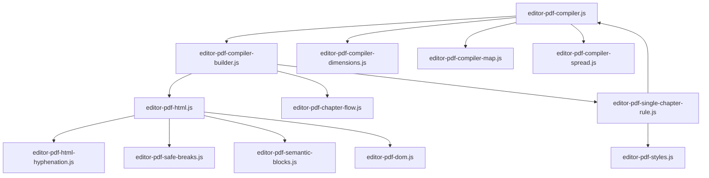

# Núcleo del Motor PDF (`assets/js/pdf/core/`)

Este directorio contiene los módulos JavaScript del núcleo del motor de paginación y compilación PDF de **Almaden Bookster**. Todos los archivos de este directorio están diseñados bajo la regla estricta de **límite de 500 líneas de código** para garantizar la mantenibilidad y modularidad.

## Actualizacion reciente: compatibilidad con el editor visual del PDF

La compilacion PDF ahora convive con una superficie editable en `Dividido` sin romper la maqueta de Paged.js. El flujo actual conserva el HTML semantico del capitulo mientras la vista visual permite edicion inline, y solo recompila cuando la edicion ya se ha sincronizado.

Puntos clave del cambio:

- `editor-pdf-compiler.js` respeta el estado de edicion y evita recompilaciones durante la interaccion activa.
- `editor-pdf-html.js` ahora marca bloques editables con identificadores estables para poder serializar fragmentos repartidos por Paged.js.
- La recompilacion posterior al guardado se aplaza hasta que el contenido ya quedo persistido.

---

## Estructura de Módulos y Flujo de Compilación

---

## Archivos y Responsabilidades

### 1. Orquestación y Compilación Principal

*   **[editor-pdf-compiler.js](file:///Users/nicolaspavez/Local%20Sites/almaden/app/public/wp-content/plugins/almaden-bookster/assets/js/pdf/core/editor-pdf-compiler.js)**
    *   **Responsabilidad**: Orquestador central del visor PDF. Controla las peticiones de compilación secuenciales (evitando condiciones de carrera) y ejecuta la instancia de `Paged.Previewer` de Paged.js.
    *   **Funciones Clave**:
        *   `compilePDFPreview`: Encola y programa ejecuciones debounced del motor de previsualización.
        *   `_compilePDFPreviewInternal`: Inicializa el DOM, carga fuentes tipográficas, ejecuta el renderizado en el scroller y actualiza los contadores de página del panel lateral.

*   **[editor-pdf-compiler-builder.js](file:///Users/nicolaspavez/Local%20Sites/almaden/app/public/wp-content/plugins/almaden-bookster/assets/js/pdf/core/editor-pdf-compiler-builder.js)**
    *   **Responsabilidad**: Construye el bloque de HTML continuo (`fullBookHTML`) antes de enviarlo a Paged.js, procesando las secciones especiales y el inicio de los capítulos.
    *   **Funciones Clave**:
        *   `window.buildContinuousBookHTML`: Itera sobre los capítulos de `bookState`, inyectando las secciones de apertura, páginas de créditos con sus blancos iniciales/finales, y las secciones del Índice.

---

### 2. Layout, Dimensiones y Paridad

*   **[editor-pdf-compiler-spread.js](file:///Users/nicolaspavez/Local%20Sites/almaden/app/public/wp-content/plugins/almaden-bookster/assets/js/pdf/core/editor-pdf-compiler-spread.js)**
    *   **Responsabilidad**: Post-procesado de las páginas maquetadas para la visualización de spreads en pantalla y la inyección dinámica de pies de página numéricos.
    *   **Funciones Clave**:
        *   `window.applySpreadPageLayout`: Ajusta dinámicamente las propiedades de rejilla CSS Grid (`grid-column`, `grid-row`, `justify-self`) para mostrar páginas encaradas (izquierda y derecha).
        *   `window.applyActiveNumericPageFooters`: Inyecta los números de página secuenciales en las cajas de margen de Paged.js respetando configuraciones de visibilidad.

*   **[editor-pdf-compiler-dimensions.js](file:///Users/nicolaspavez/Local%20Sites/almaden/app/public/wp-content/plugins/almaden-bookster/assets/js/pdf/core/editor-pdf-compiler-dimensions.js)**
    *   **Responsabilidad**: Conversión métrica física. Convierte tamaños de página (A4, Carta, Personalizados) y márgenes de centímetros/pulgadas a píxeles de pantalla.
    *   **Funciones Clave**:
        *   `calculatePageDimensions`: Retorna anchos, altos, factores de escala y altura interna máxima para el renderizado.

*   **[editor-pdf-compiler-parity.js](file:///Users/nicolaspavez/Local%20Sites/almaden/app/public/wp-content/plugins/almaden-bookster/assets/js/pdf/core/editor-pdf-compiler-parity.js)**
    *   **Responsabilidad**: Controla la inyección de saltos de página lógicos y páginas en blanco basadas en el flujo físico.

*   **[editor-pdf-chapter-flow.js](file:///Users/nicolaspavez/Local%20Sites/almaden/app/public/wp-content/plugins/almaden-bookster/assets/js/pdf/core/editor-pdf-chapter-flow.js)**
    *   **Responsabilidad**: Resuelve el modo de apertura configurado de los capítulos y su paridad inicial.

*   **[editor-pdf-single-chapter-rule.js](file:///Users/nicolaspavez/Local%20Sites/almaden/app/public/wp-content/plugins/almaden-bookster/assets/js/pdf/core/editor-pdf-single-chapter-rule.js)**
    *   **Responsabilidad**: Aísla la regla editorial especial cuando el libro tiene un único capítulo. Este helper permite preguntar primero si el libro es de un solo capítulo y, si corresponde, normalizar el arranque en página 1 para que el blanco inicial no desplace la numeración del capítulo ni la decisión del blanco final.

*   **[editor-pdf-compiler-map.js](file:///Users/nicolaspavez/Local%20Sites/almaden/app/public/wp-content/plugins/almaden-bookster/assets/js/pdf/core/editor-pdf-compiler-map.js)**
    *   **Responsabilidad**: Control de caché de paginación del libro completo.
    *   **Funciones Clave**:
        *   `window.getBookPageMapSignature`: Genera una firma JSON basada en el contenido del libro y ajustes para verificar si requiere re-paginarse.
        *   `window.ensureBookPageMap`: Ejecuta una paginación silenciosa en un scroller temporal `#dummy-pdf-scroller` en segundo plano para cachear las posiciones de inicio de cada capítulo.

---

### 3. Generación y Procesamiento de HTML

*   **[editor-pdf-html.js](file:///Users/nicolaspavez/Local%20Sites/almaden/app/public/wp-content/plugins/almaden-bookster/assets/js/pdf/core/editor-pdf-html.js)** (y sus submódulos)
    *   **Responsabilidad**: Traduce Markdown a HTML semántico y genera las plantillas HTML del capítulo. Dividido en submódulos para respetar el límite de líneas:
        *   `-images.js`: Normalización y cálculo de dimensiones/restricciones de bloques de imagen.
        *   `-opening.js`: Lógica para generar los bloques de apertura del capítulo y limpiar encabezados duplicados.
        *   `-credits.js`: Generación de la plantilla HTML específica para la sección de Créditos.
    *   **Funciones Clave**:
        *   `window.buildChapterHTML` (en el archivo principal): Coordina la construcción del HTML utilizando los submódulos, aplicando decoraciones y prefijos.
        *   `window.updateTOCPagesInCache`: Actualiza dinámicamente los números de página en el Índice mapeándolos con la caché de paginación activa.

*   **[editor-pdf-html-hyphenation.js](file:///Users/nicolaspavez/Local%20Sites/almaden/app/public/wp-content/plugins/almaden-bookster/assets/js/pdf/core/editor-pdf-html-hyphenation.js)**
    *   **Responsabilidad**: Algoritmo de silabación y guionado (hyphenation) automático de texto en español.
    *   **Funciones Clave**:
        *   `window.almadenApplyHyphenationToHtml`: Recorre los nodos de texto e inyecta guiones suaves (soft-hyphens `\u00AD`) basados en las reglas silábicas del español (diptongos, triptongos, excepciones).

*   **[editor-pdf-dom.js](file:///Users/nicolaspavez/Local%20Sites/almaden/app/public/wp-content/plugins/almaden-bookster/assets/js/pdf/core/editor-pdf-dom.js)**
    *   **Responsabilidad**: Elementos de fábrica HTML para crear envolturas virtuales de páginas y contenedores de notas.

*   **[editor-pdf-safe-breaks.js](file:///Users/nicolaspavez/Local%20Sites/almaden/app/public/wp-content/plugins/almaden-bookster/assets/js/pdf/core/editor-pdf-safe-breaks.js)**
    *   **Responsabilidad**: Aplica reglas de saltos de página seguros en elementos blockquote y listas.

*   **[editor-pdf-semantic-blocks.js](file:///Users/nicolaspavez/Local%20Sites/almaden/app/public/wp-content/plugins/almaden-bookster/assets/js/pdf/core/editor-pdf-semantic-blocks.js)**
    *   **Responsabilidad**: Post-procesado de contenedores semánticos especiales (`[box]`, `[align]`).
