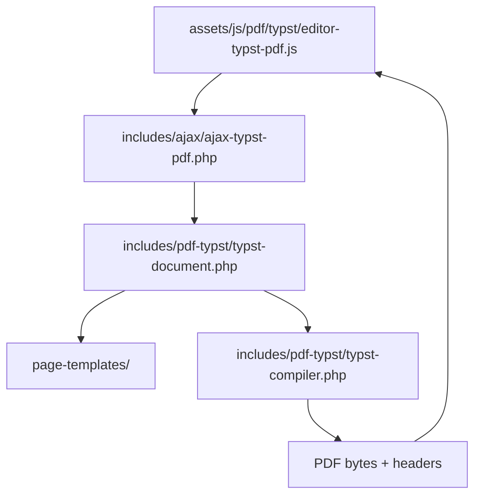

# Motor Typst de PDF

Este módulo es la superficie activa que convierte el estado del editor en un
documento Typst, lo compila con el binario local y devuelve el PDF que consume
el preview del editor.

> No usa Paged.js. El preview visual del libro en esta etapa depende de Typst
> + PDF.js para renderizar el PDF resultante.

## Pipeline general

1. El preview del editor serializa `bookState` y envía el payload al endpoint
   autenticado.
2. `ajax-typst-pdf.php` valida permisos, revive las plantillas persistidas del
   libro y adjunta la configuración de portada.
3. `typst-document.php` orquesta el proceso: carga los helpers, pide el
   contexto tipográfico, obtiene el prefijo Typst y termina de ensamblar el
   documento final con assets y debug semántico.
4. `typst-compiler.php` resuelve el binario Typst, compila el archivo temporal
   y valida el texto extraído del PDF.
5. El endpoint devuelve el PDF más headers de geometría, flujo y diagnóstico.

## Archivos y funciones clave

### `typst-document.php`

Responsabilidad: orquestar la construcción del documento Typst completo sin
mezclar toda la lógica en un solo archivo.

Funciones principales:

- `almaden_bookster_build_typst_document()`: punto de entrada único que une
  el contexto, el prefijo Typst y el render final.

### `typst-document-context.php`

Responsabilidad: normalizar settings y resolver geometría, tipografía, reservas
de header/footer, footnotes y valores derivados.

Funciones principales:

- `almaden_bookster_typst_build_document_context()`: devuelve un array con
  todo el contexto calculado para el build.

### `typst-document-prefix.php`

Responsabilidad: generar el prefijo Typst y preparar el estado inicial del
render.

Funciones principales:

- `almaden_bookster_typst_build_document_prefix()`: construye el preámbulo del
  source Typst, inicializa assets y closures de resolución de fuentes.

### `typst-document-helpers.php`

Responsabilidad: helpers base reutilizables por todo el motor Typst.

Funciones principales:

- `almaden_bookster_typst_number()`
- `almaden_bookster_typst_transform_title()`
- `almaden_bookster_typst_normalize_header_footer_type()`
- `almaden_bookster_typst_bool()`
- `almaden_bookster_typst_credits_*()`
- `almaden_bookster_typst_chapter_opening_visibility()`

### `typst-document-render-helpers.php`

Responsabilidad: utilidades de render específico para Typst.

Funciones principales:

- `almaden_bookster_typst_toc_roman()`
- `almaden_bookster_typst_render_toc()`
- `almaden_bookster_typst_render_credits()`
- `almaden_bookster_typst_pt_to_unit()`
- `almaden_bookster_typst_length_literal()`
- `almaden_bookster_typst_running_element_has_content()`
- `almaden_bookster_typst_register_upload()`

### Plantillas de página

Las funciones de plantillas físicas siguen viviendo en `page-templates/` y son
consumidas desde el composer Typst:

- `almaden_bookster_typst_page_template_context()`
- `almaden_bookster_typst_compose_page_templates()`
- `almaden_bookster_typst_apply_page_template_flow()`
- `almaden_bookster_typst_page_template_prepare_word_probe()`
- `almaden_bookster_typst_page_template_fragment_layout()`
- `almaden_bookster_typst_page_template_render_slot()`
- `almaden_bookster_typst_page_template_placeholder()`

Puntos editoriales relevantes:

- `chapter_page_one_align` controla la posición de la apertura cuando esta se
  separa del contenido.
- `opening_separate_content` o `book_separate_opening_content` decide si la
  apertura ocupa una página dedicada.
- Cuando la apertura va separada, el renderer usa un wrapper de página
  completa con `#box(width: 100%, height: 100%)` y `#place(...)` para alinear
  el bloque dentro del área editorial.
- Las plantillas físicas se aplican sobre el flujo ya medido por Typst; no se
  estiman por HTML ni por Paged.js.

### `typst-compiler.php`

Responsabilidad: ejecutar Typst y validar el PDF generado.

Funciones principales:

- `almaden_bookster_find_typst_binary()`: localiza el binario Typst.
- `almaden_bookster_typst_find_pdftotext_binary()`: localiza `pdftotext` para
  la validación semántica.
- `almaden_bookster_compile_typst_pdf()`: compila el source, lee el PDF
  generado y compara el texto extraído con el contenido esperado.
- `almaden_bookster_typst_is_subsequence()`: valida que el texto compilado
  conserve la secuencia semántica esperada.

### `../ajax/ajax-typst-pdf.php`

Responsabilidad: endpoint autenticado para el preview Typst.

- Verifica nonce y permisos de edición.
- Limpia el payload antes de compilar.
- Reinyecta `page_templates` persistidas desde `_almaden_page_templates`.
- Adjunta `coverSettings` y `cover_settings`.
- Devuelve headers útiles para depuración:
  - `X-Almaden-PDF-Geometry`
  - `X-Almaden-Page-Flow`
  - `X-Almaden-Page-Template-Results`
  - `X-Almaden-Typst-Opening-Debug`
  - `X-Almaden-PDF-Integrity`

## Datos que vale la pena respetar

- `_almaden_page_templates` es el origen persistente de las plantillas físicas.
- `settings.page_templates` es la copia que consume el compilador durante la
  sesión actual.
- Cada plantilla tiene un `instance_id` estable y un `anchor.flow_id`; la
  página física se recalcula y se devuelve como `resolved_page`.
- Cada slot debe conservar un `id` estable para que el panel de imágenes pueda
  reencontrarlo después de recompilar.
- Los assets insertados en Typst se registran solo si viven dentro de
  `wp-content/uploads`; eso evita escapar del sandbox de medios de WordPress.

## Estrategia para futuras modificaciones

1. Si agregas un nuevo preset, primero extiende el registry de plantillas y
   luego normalízalo en el normalizer.
2. Si cambias la manera en que se cortan páginas con imagen, hazlo en la capa
   `page-templates/`, no dentro del compositor principal.
3. Si modificas apertura separada o alineaciones, usa siempre el composer
   Typst y no una estimación visual del DOM.
4. Si necesitas más trazabilidad, añade headers nuevos desde el endpoint y
   léelos en `assets/js/pdf/typst/editor-typst-pdf.js`.
5. Si un archivo nuevo de este módulo supera 500 líneas, divídelo de inmediato
   para seguir el `AGENT_GUIDELINES.md`.

## Estado de cumplimiento AGENTS

La arquitectura está modularizada, pero hay dos archivos activos que hoy exceden
el límite de 500 líneas y conviene seguir partiendo en futuras iteraciones:

- `assets/js/pdf/typst/editor-typst-pdf.js`

No se tocan aquí por la documentación, pero deben ser candidatos prioritarios
si este módulo sigue creciendo.
