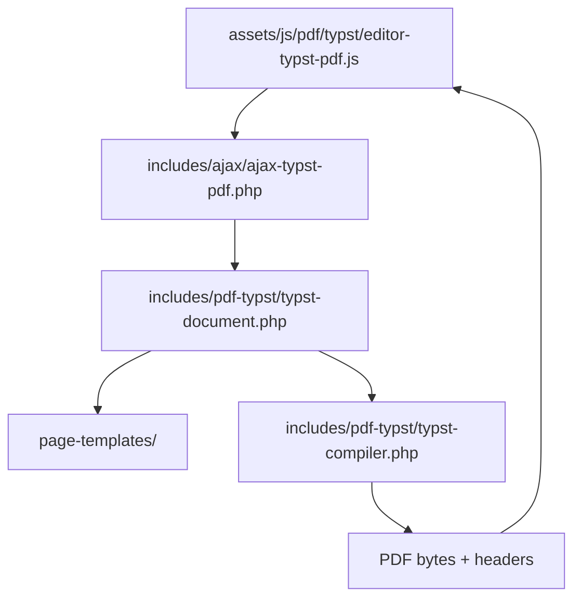

# Motor Typst de PDF

Este módulo es la superficie activa que convierte el estado del editor en un
documento Typst, lo compila con el binario local y devuelve el PDF que consume
el preview del editor.

> No usa Paged.js. El preview visual del libro en esta etapa depende de Typst
> + PDF.js para renderizar el PDF resultante.

## Pipeline general

1. El preview del editor serializa `bookState` y envía el payload al endpoint
   autenticado.
2. `ajax-typst-pdf.php` valida permisos, revive las plantillas persistidas del
   libro y adjunta la configuración de portada.
3. `typst-document.php` orquesta el proceso: carga los helpers, pide el
   contexto tipográfico, obtiene el prefijo Typst y termina de ensamblar el
   documento final con assets y debug semántico.
4. `typst-compiler.php` resuelve el binario Typst, compila el archivo temporal
   y valida el texto extraído del PDF.
5. El endpoint devuelve el PDF más headers de geometría, flujo y diagnóstico.

## Plantillas y estilos por página

En este módulo conviven dos capas distintas que el editor expone como pestañas
separadas:

- `Plantilla` define la estructura física de una página.
- `Estilo` define la apariencia visual de esa misma página.

Las dos capas pueden coexistir. Una misma página puede tener plantilla y estilo
al mismo tiempo, porque una controla el layout y la otra controla el look.

### Qué hace cada capa

#### Plantillas

Las plantillas viven en `includes/pdf-typst/page-templates/` y describen cómo
se divide la página seleccionada:

- cuántos bloques visuales reserva;
- dónde queda el contenido principal;
- qué zonas quedan como slots de imagen;
- si el preset ocupa una página completa o solo una parte del área de
  contenido.

Los presets visibles hoy se registran en `page-template-registry.php`. Cada
uno se muestra en la UI como una miniatura con su nombre pequeño debajo, para
que el selector siga siendo legible cuando haya muchas opciones.

Los datos persistidos viven en `_almaden_page_templates` y se normalizan antes
de llegar al compilador Typst. La identidad importante no es la posición
visual momentánea, sino `instance_id` + `anchor.flow_id`. `resolved_page` solo
es el resultado de la maquetación actual.

#### Estilos

Los estilos viven en `includes/pdf-typst/page-styles/` y trabajan sobre la
apariencia de una página ya resuelta:

- fondo sólido, degradado o imagen;
- overlay del fondo cuando se usa imagen;
- color de texto por zona: `content`, `header`, `footer` y `opening`.

Los datos persistidos viven en `_almaden_page_styles` y se guardan en
`settings.page_styles` durante la compilación.

### Cómo entra al PDF

1. La UI escribe `page_templates` y `page_styles` en `bookState.settings`.
2. Los endpoints AJAX reinyectan la versión persistida antes de compilar.
3. `typst-document-context.php` construye el contexto final para Typst.
4. `typst-document-prefix.php` genera las funciones Typst que resuelven el
   color de cada página y la envoltura visual del contenido.
5. `page-template-composer.php` inserta la estructura física de la plantilla
   sobre el flujo de texto ya medido por Typst.

### En Typst

El prefijo Typst define dos helpers que usan los estilos:

- `almaden-page-style-color(kind)`: resuelve el paint de página para `fill`
  y el color de texto para `content`, `header`, `footer` u `opening`.
- `almaden-page-styled(kind, body)`: aplica ese color al bloque recibido.

Luego el compositor de plantillas usa esos helpers para envolver el contenido
de la página correcta sin romper el reflujo del libro.

### Relación entre ambas capas

- Una plantilla decide cuántos slots existen y dónde viven.
- Un estilo decide cómo se ve la página final.
- Si una plantilla deja un slot de imagen vacío, ese slot aparece como
  placeholder hasta que el usuario asigne un asset.
- Si una página tiene estilo pero no plantilla, el estilo igual se aplica.
- Si una página tiene plantilla pero no estilo, Typst cae en los colores por
  defecto.

### Archivos de referencia

- `includes/pdf-typst/page-templates/README.md`
- `includes/pdf-typst/page-styles/README.md`

## Archivos y funciones clave

### `typst-document.php`

Responsabilidad: orquestar la construcción del documento Typst completo sin
mezclar toda la lógica en un solo archivo.

Funciones principales:

- `almaden_bookster_build_typst_document()`: punto de entrada único que une
  el contexto, el prefijo Typst y el render final.

### `typst-document-context.php`

Responsabilidad: normalizar settings y resolver geometría, tipografía, reservas
de header/footer, footnotes y valores derivados.

Funciones principales:

- `almaden_bookster_typst_build_document_context()`: devuelve un array con
  todo el contexto calculado para el build.

### `typst-document-prefix.php`

Responsabilidad: generar el prefijo Typst y preparar el estado inicial del
render.

Funciones principales:

- `almaden_bookster_typst_build_document_prefix()`: construye el preámbulo del
  source Typst, inicializa assets y closures de resolución de fuentes.

### `typst-document-helpers.php`

Responsabilidad: helpers base reutilizables por todo el motor Typst.

Funciones principales:

- `almaden_bookster_typst_number()`
- `almaden_bookster_typst_transform_title()`
- `almaden_bookster_typst_normalize_header_footer_type()`
- `almaden_bookster_typst_bool()`
- `almaden_bookster_typst_credits_*()`
- `almaden_bookster_typst_chapter_opening_visibility()`

### `typst-compiler-assets.php`

Responsabilidad: copiar y verificar atómicamente las imágenes dentro del
directorio temporal antes de que Typst consulte o compile el documento.

### `typst-image-block.php`

Responsabilidad: convertir el `<figure data-image-block>` en una imagen Typst
con altura, márgenes y pie de foto, y emitir la geometría necesaria para que
PDF.js seleccione la imagen sin seleccionar su página.

### `typst-document-render-helpers.php`

Responsabilidad: utilidades de render específico para Typst.

Funciones principales:

- `almaden_bookster_typst_render_credits()`
- `almaden_bookster_typst_pt_to_unit()`
- `almaden_bookster_typst_length_literal()`
- `almaden_bookster_typst_running_element_has_content()`
- `almaden_bookster_typst_register_upload()`

### `typst-toc.php`

Responsabilidad: construir el Índice como una tabla editorial sin bordes.

La estructura del Índice se modela como una fila de tres celdas físicas:

- `{n}` o `{r}`: numeración del capítulo, opcional.
- `{chapter title}` + `{line}`: contenido central donde el leader continúa el
  flujo tipográfico del título.
- `{pn}`: número de página.

Cada fila vive como una unidad editorial, pero cada elemento mantiene su propia
configuración tipográfica. Eso permite ajustar de forma independiente:

- familia, peso, estilo y tracking de `{n}` / `{r}`;
- familia, peso, estilo, tamaño y alineación del `{chapter title}`;
- tipo de leader (`dotted`, `solid`, `dashed` o `none`);
- familia, peso, estilo y tracking del `{pn}`.

El renderer aplica además estas reglas de composición:

- La columna de numeración no se mide por el ancho de cada fila, sino por el
  número más ancho entre todos los capítulos visibles. Así, si un capítulo usa
  `I.` y otro usa `XXII.`, la celda de `{n}` ocupa el ancho de `XXII.` y todos
  los títulos arrancan desde el mismo eje.
- El título y el leader comparten la celda central. El leader es un elemento
  flexible `1fr` dentro del mismo párrafo: si el título ocupa dos o más líneas,
  comienza inmediatamente después de la última palabra de la última línea y
  completa el espacio hasta `{pn}`.
- `dotted` repite el glifo tipográfico `.`, `solid` dibuja una línea continua,
  `dashed` conserva la variante a rayas y `none` omite el leader.
- Si no hay numeración activa, la tabla se reduce a dos celdas: contenido
  central (`{chapter title}` + `{line}`) y `{pn}`.
- La posición vertical del número de página puede ajustarse con el offset
  `page_number_offset`, que se traduce a `#move(dy: ...)` al renderizar Typst.

Funciones principales:

- `almaden_bookster_typst_toc_roman()`
- `almaden_bookster_typst_toc_number_samples()`
- `almaden_bookster_typst_render_toc()`

### Plantillas de página

Las funciones de plantillas físicas siguen viviendo en `page-templates/` y son
consumidas desde el composer Typst:

- `almaden_bookster_typst_page_template_context()`
- `almaden_bookster_typst_compose_page_templates()`
- `almaden_bookster_typst_apply_page_template_flow()`
- `almaden_bookster_typst_page_template_prepare_word_probe()`
- `almaden_bookster_typst_page_template_fragment_layout()`
- `almaden_bookster_typst_page_template_render_slot()`
- `almaden_bookster_typst_page_template_placeholder()`

Puntos editoriales relevantes:

- `chapter_page_one_align` controla la posición de la apertura cuando esta se
  separa del contenido.
- `opening_separate_content` o `book_separate_opening_content` decide si la
  apertura ocupa una página dedicada.
- Cuando la apertura va separada, el renderer usa un wrapper de página
  completa con `#box(width: 100%, height: 100%)` y `#place(...)` para alinear
  el bloque dentro del área editorial.
- Las plantillas físicas se aplican sobre el flujo ya medido por Typst; no se
  estiman por HTML ni por Paged.js.

### `typst-compiler.php`

Responsabilidad: ejecutar Typst y validar el PDF generado.

Funciones principales:

- `almaden_bookster_find_typst_binary()`: localiza el binario Typst.
- `almaden_bookster_typst_find_pdftotext_binary()`: localiza `pdftotext` para
  la validación semántica.
- `almaden_bookster_compile_typst_pdf()`: compila el source, lee el PDF
  generado y compara el texto extraído con el contenido esperado.
- `almaden_bookster_typst_is_subsequence()`: valida que el texto compilado
  conserve la secuencia semántica esperada.

### `../ajax/ajax-typst-pdf.php`

Responsabilidad: endpoint autenticado para el preview Typst.

- Verifica nonce y permisos de edición.
- Limpia el payload antes de compilar.
- Reinyecta `page_templates` persistidas desde `_almaden_page_templates`.
- Adjunta `coverSettings` y `cover_settings`.
- Devuelve headers útiles para depuración:
  - `X-Almaden-PDF-Geometry`
  - `X-Almaden-Page-Flow`
  - `X-Almaden-Page-Template-Results`
  - `X-Almaden-Typst-Opening-Debug`
  - `X-Almaden-PDF-Integrity`

## Datos que vale la pena respetar

- `_almaden_page_templates` es el origen persistente de las plantillas físicas.
- `settings.page_templates` es la copia que consume el compilador durante la
  sesión actual.
- `settings.pdf_preview_mode`, `settings.pdf_preview_asset_mode` y
  `settings.pdf_preview_counter_mode` definen el contrato base para las fases
  del preview por capítulo. `pdf_preview_asset_mode = optimized` se usa para
  el preview del editor y `original` se fuerza en la descarga final para que
  nunca se exporten assets livianos.
- `bookState.pdfPreview` es el contenedor serializable del estado de preview
  que usará la próxima fase para decidir modo, assets y contador universal.
  El backend ahora devuelve `X-Almaden-Universal-Counter` con los inicios de
  capítulo; el navegador lo combina con `pdfDocument.numPages` para obtener
  rangos globales reales.
- Cada plantilla tiene un `instance_id` estable y un `anchor.flow_id`; la
  página física se recalcula y se devuelve como `resolved_page`.
- Cada slot debe conservar un `id` estable para que el panel de imágenes pueda
  reencontrarlo después de recompilar.
- Los assets insertados en Typst se registran solo si viven dentro de
  `wp-content/uploads`; eso evita escapar del sandbox de medios de WordPress.

## Estrategia para futuras modificaciones

1. Si agregas un nuevo preset, primero extiende el registry de plantillas y
   luego normalízalo en el normalizer.
2. Si cambias la manera en que se cortan páginas con imagen, hazlo en la capa
   `page-templates/`, no dentro del compositor principal.
3. Si modificas apertura separada o alineaciones, usa siempre el composer
   Typst y no una estimación visual del DOM.
4. Si necesitas más trazabilidad, añade headers nuevos desde el endpoint y
   léelos en `assets/js/pdf/typst/editor-typst-pdf.js`.
5. Si un archivo nuevo de este módulo supera 500 líneas, divídelo de inmediato
   para seguir el `AGENT_GUIDELINES.md`.

## Estado de cumplimiento AGENTS

La arquitectura está modularizada, pero hay dos archivos activos que hoy exceden
el límite de 500 líneas y conviene seguir partiendo en futuras iteraciones:

- `assets/js/pdf/typst/editor-typst-pdf.js`

No se tocan aquí por la documentación, pero deben ser candidatos prioritarios
si este módulo sigue creciendo.
