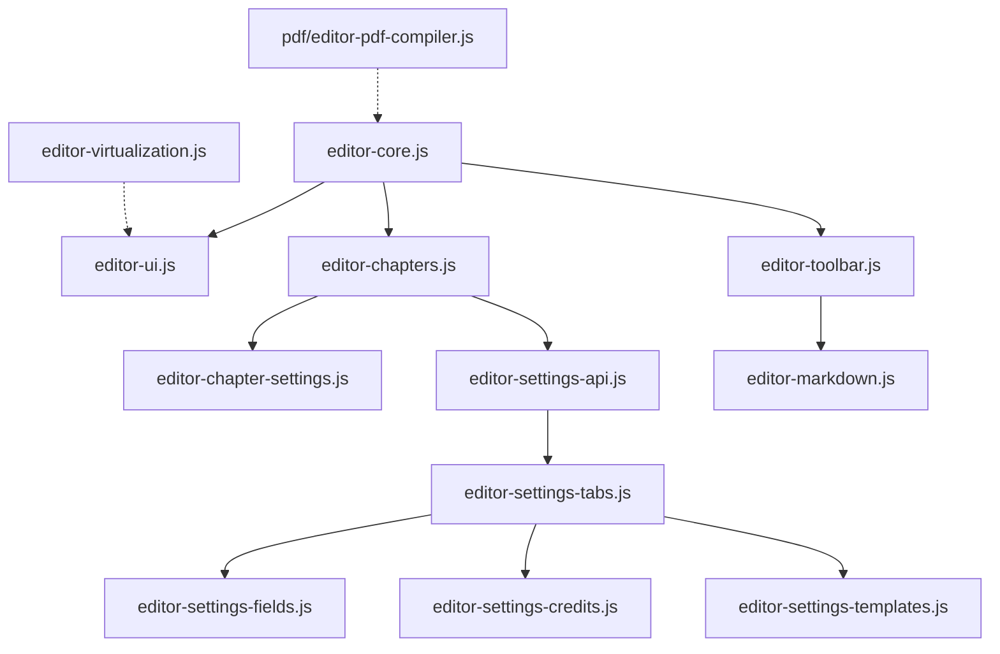
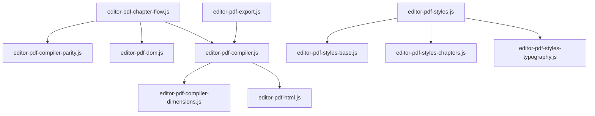
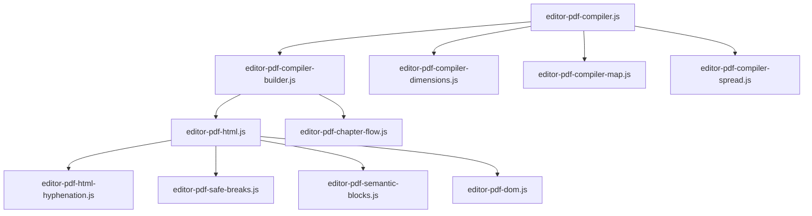

# README Analysis

## Folder: `.`
**Files:** .DS_Store, .git/, AGENT_GUIDELINES.md, admin/, almaden-bookster.php, assets/, docs/, includes/, modules/, templates/
**Current README:**
```markdown
# Almaden Bookster

Plugin principal de Almaden para crear libros, editar contenido, diseñar portadas, publicar una estanteria publica, renderizar lectores y conectar quizzes por capitulo con Learni.

## Leer primero

Si eres un agente o vas a modificar codigo, usa este orden:

1. [AGENT_GUIDELINES.md](file:///Users/nicolaspavez/Local%20Sites/almaden/app/public/wp-content/plugins/almaden-bookster/AGENT_GUIDELINES.md)
2. Este [README.md](file:///Users/nicolaspavez/Local%20Sites/almaden/app/public/wp-content/plugins/almaden-bookster/README.md)
3. [includes/README.md](file:///Users/nicolaspavez/Local%20Sites/almaden/app/public/wp-content/plugins/almaden-bookster/includes/README.md)
4. La carpeta que corresponda al area a tocar:
- [templates/editor/README.md](file:///Users/nicolaspavez/Local%20Sites/almaden/app/public/wp-content/plugins/almaden-bookster/templates/editor/README.md)
- [templates/cover/README.md](file:///Users/nicolaspavez/Local%20Sites/almaden/app/public/wp-content/plugins/almaden-bookster/templates/cover/README.md)
- [templates/bookshelf/README.md](file:///Users/nicolaspavez/Local%20Sites/almaden/app/public/wp-content/plugins/almaden-bookster/templates/bookshelf/README.md)
   - [templates/reader/README.md](file:///Users/nicolaspavez/Local%20Sites/almaden/app/public/wp-content/plugins/almaden-bookster/templates/reader/README.md)
   - [templates/quiz-builder/README.md](file:///Users/nicolaspavez/Local%20Sites/almaden/app/public/wp-content/plugins/almaden-bookster/templates/quiz-builder/README.md)
5. [assets/js/README.md](file:///Users/nicolaspavez/Local%20Sites/almaden/app/public/wp-content/plugins/almaden-bookster/assets/js/README.md)

## Estado actual del plugin

- CPTs de libros y capitulos.
- Editor de contenido de libros.
- Editor de portadas.
- Configuracion interna de rutas y paginas del creador.
- Libreria publica.
- Reader publico.
- Integracion con Learni para quizzes de libro y quizzes por capitulo.
- Nuevo quiz builder por capitulo con panel de prompts, preview y contenido raw.

## Mapa rapido por funcionalidad

### Backend PHP

- [includes/README.md](file:///Users/nicolaspavez/Local%20Sites/almaden/app/public/wp-content/plugins/almaden-bookster/includes/README.md)
- [includes/ajax/README.md](file:///Users/nicolaspavez/Local%20Sites/almaden/app/public/wp-content/plugins/almaden-bookster/includes/ajax/README.md)
- [includes/learni-integration.php](file:///Users/nicolaspavez/Local%20Sites/almaden/app/public/wp-content/plugins/almaden-bookster/includes/learni-integration.php)

### Templates

- Taller / admin: [templates/admin/README.md](file:///Users/nicolaspavez/Local%20Sites/almaden/app/public/wp-content/plugins/almaden-bookster/templates/admin/README.md)
- Book editor: [templates/editor/README.md](file:///Users/nicolaspavez/Local%20Sites/almaden/app/public/wp-content/plugins/almaden-bookster/templates/editor/README.md)
- Cover editor: [templates/cover/README.md](file:///Users/nicolaspavez/Local%20Sites/almaden/app/public/wp-content/plugins/almaden-bookster/templates/cover/README.md)
- Catálogo público: [templates/bookshelf/README.md](file:///Users/nicolaspavez/Local%20Sites/almaden/app/public/wp-content/plugins/almaden-bookster/templates/bookshelf/README.md)
- Reader: [templates/reader/README.md](file:///Users/nicolaspavez/Local%20Sites/almaden/app/public/wp-content/plugins/almaden-bookster/templates/reader/README.md)
- Quiz builder: [templates/quiz-builder/README.md](file:///Users/nicolaspavez/Local%20Sites/almaden/app/public/wp-content/plugins/almaden-bookster/templates/quiz-builder/README.md)

### Frontend JS

- [assets/js/README.md](file:///Users/nicolaspavez/Local%20Sites/almaden/app/public/wp-content/plugins/almaden-bookster/assets/js/README.md)
- [assets/js/editor/README.md](file:///Users/nicolaspavez/Local%20Sites/almaden/app/public/wp-content/plugins/almaden-bookster/assets/js/editor/README.md)
- [assets/js/cover/README.md](file:///Users/nicolaspavez/Local%20Sites/almaden/app/public/wp-content/plugins/almaden-bookster/assets/js/cover/README.md)
- [assets/js/reader/README.md](file:///Users/nicolaspavez/Local%20Sites/almaden/app/public/wp-content/plugins/almaden-bookster/assets/js/reader/README.md)
- [assets/js/pdf/README.md](file:///Users/nicolaspavez/Local%20Sites/almaden/app/public/wp-content/plugins/almaden-bookster/assets/js/pdf/README.md)
- [assets/js/quiz-builder/README.md](file:///Users/nicolaspavez/Local%20Sites/almaden/app/public/wp-content/plugins/almaden-bookster/assets/js/quiz-builder/README.md)

## Flujo de quiz con Learni

Cuando trabajes en quizzes:

1. Revisa primero [includes/learni-integration.php](file:///Users/nicolaspavez/Local%20Sites/almaden/app/public/wp-content/plugins/almaden-bookster/includes/learni-integration.php).
2. Luego revisa [templates/quiz-builder/quiz-builder-app.php](file:///Users/nicolaspavez/Local%20Sites/almaden/app/public/wp-content/plugins/almaden-bookster/templates/quiz-builder/quiz-builder-app.php).
3. Si el cambio afecta persistencia o CRUD del quiz, entra a:
   - [learni-standalone/includes/QuizEditor/QuizEditor.php](file:///Users/nicolaspavez/Local%20Sites/almaden/app/public/wp-content/plugins/learni-standalone/includes/QuizEditor/QuizEditor.php)
   - [learni-standalone/includes/QuizEditor/QuizRepository.php](file:///Users/nicolaspavez/Local%20Sites/almaden/app/public/wp-content/plugins/learni-standalone/includes/QuizEditor/QuizRepository.php)

## Regla importante para paginas publicas

Para paginas publicas integradas con el tema, no se debe reemplazar toda la pagina con `template_redirect` si el objetivo es mantener el layout del tema activo. En esos casos, el contenido debe entrar por `the_content`.

Las apps tipo dashboard o editor interno si pueden usar `template_redirect` para renderizar una superficie limpia desde cero.
```

## Folder: `admin`
**Files:** admin-fonts-page.php
**Current README:**
```markdown
# Directorio admin

Este directorio forma parte del plugin Almaden Bookster.
Archivos y subdirectorios contenidos aquí:

* admin-fonts-page.php
```

## Folder: `assets`
**Files:** css/, js/
**Current README:**
```markdown
# Directorio assets

Este directorio forma parte del plugin Almaden Bookster.
Archivos y subdirectorios contenidos aquí:

* css
* js
```

## Folder: `assets/css`
**Files:** admin-filesize-page.css, admin-fonts-page.css, authors/, editor-style.css, publishers/, quiz-builder/, reader-app.css
**Current README:**
```markdown
# Directorio css

Este directorio forma parte del plugin Almaden Bookster.
Archivos y subdirectorios contenidos aquí:

* admin-fonts-page.css
* editor-style.css
* authors
* quiz-builder
* reader-app.css

## Nota reciente

`editor-style.css` incluye ahora los estilos de la superficie editable del PDF en la vista `Dividido`. Esa capa ya no se comporta como un overlay separado; la seleccion y el caret se dibujan sobre el propio contenido renderizado por Paged.js para mantener alineacion visual y edicion confiable.
```

## Folder: `assets/css/quiz-builder`
**Files:** quiz-builder-app.css
**Current README:**
```markdown
# Directorio quiz-builder

Este directorio forma parte del plugin Almaden Bookster.
Archivos y subdirectorios contenidos aquí:

* quiz-builder-app.css
```

## Folder: `assets/js`
**Files:** admin/, almaden-shortcodes.js, authors/, cover/, editor/, pdf/, publishers/, quiz-builder/, reader/, vendor/
**Current README:**
```markdown
# Directorio JS (`assets/js/`) - Arquitectura Frontend Reorganizada

Este directorio contiene todo el código de JavaScript de la aplicación. Siguiendo el principio de **Modularidad Extrema** (con un límite estricto de <500 líneas por archivo), los archivos se agrupan en subcarpetas funcionales:

## Estructura de Directorios

```
assets/js/
├── admin/          # Panel de administración de WordPress y Taller
├── editor/         # Interfaz de edición del libro (Content Editor)
├── pdf/            # Motor de renderizado PDF (Virtual Pagination Engine)
├── reader/         # Lector público de eBooks (Web Reader)
├── cover/          # Editor de Portadas (Bookster Cover Editor)
├── authors/        # Página de autores, perfiles y modal de edición
├── quiz-builder/   # Creador de evaluaciones interactivo (Quiz Builder)
└── almaden-shortcodes.js # Procesamiento de shortcodes comunes
```

---

## 🔗 Subcarpetas del Frontend
*   **Taller y Admin**: [assets/js/admin/](file:///Users/nicolaspavez/Local%20Sites/almaden/app/public/wp-content/plugins/almaden-bookster/assets/js/admin/)
*   **Editor de Contenido**: [assets/js/editor/](file:///Users/nicolaspavez/Local%20Sites/almaden/app/public/wp-content/plugins/almaden-bookster/assets/js/editor/)
*   **Motor PDF**: [assets/js/pdf/](file:///Users/nicolaspavez/Local%20Sites/almaden/app/public/wp-content/plugins/almaden-bookster/assets/js/pdf/)
*   **Lector eBook**: [assets/js/reader/](file:///Users/nicolaspavez/Local%20Sites/almaden/app/public/wp-content/plugins/almaden-bookster/assets/js/reader/)
*   **Diseñador de Portadas**: [assets/js/cover/](file:///Users/nicolaspavez/Local%20Sites/almaden/app/public/wp-content/plugins/almaden-bookster/assets/js/cover/)
*   **Autores**: [assets/js/authors/](file:///Users/nicolaspavez/Local%20Sites/almaden/app/public/wp-content/plugins/almaden-bookster/assets/js/authors/)
*   **Creador de Quizzes**: [assets/js/quiz-builder/](file:///Users/nicolaspavez/Local%20Sites/almaden/app/public/wp-content/plugins/almaden-bookster/assets/js/quiz-builder/)
*   **Shortcodes Comunes**: [almaden-shortcodes.js](file:///Users/nicolaspavez/Local%20Sites/almaden/app/public/wp-content/plugins/almaden-bookster/assets/js/almaden-shortcodes.js)

---

## 1. Módulos de Administración ([admin/](file:///Users/nicolaspavez/Local%20Sites/almaden/app/public/wp-content/plugins/almaden-bookster/assets/js/admin/))

*   **[admin-fonts-page.js](file:///Users/nicolaspavez/Local%20Sites/almaden/app/public/wp-content/plugins/almaden-bookster/assets/js/admin/admin-fonts-page.js)**: 
    Interactividad para la pantalla de configuración en el WP Admin Dashboard, concretamente para buscar, instalar, probar Google Drive y desinstalar archivos tipográficos.
*   **[booklist-ui.js](file:///Users/nicolaspavez/Local%20Sites/almaden/app/public/wp-content/plugins/almaden-bookster/assets/js/admin/booklist-ui.js)**: 
    Controla el dashboard o taller de listado de libros (crear nuevo libro, duplicar, eliminar, publicar en el Ebook Store).

---

## 2. Componentes del Editor ([editor/](file:///Users/nicolaspavez/Local%20Sites/almaden/app/public/wp-content/plugins/almaden-bookster/assets/js/editor/))

*   **[editor-core.js](file:///Users/nicolaspavez/Local%20Sites/almaden/app/public/wp-content/plugins/almaden-bookster/assets/js/editor/editor-core.js)**: 
    El cerebro de la aplicación. Maneja la inicialización principal (`window.onload`), la gestión del estado global (`bookState`), y la declaración del `initEventListeners` central.
*   **[editor-ui.js](file:///Users/nicolaspavez/Local%20Sites/almaden/app/public/wp-content/plugins/almaden-bookster/assets/js/editor/editor-ui.js)**: 
    Controla de forma exclusiva la interfaz de usuario. Maneja cambios de tema visual (claro, sepia, oscuro), los modos de vista, la barra lateral de capítulos, y el sistema de notificaciones (Toasts).
*   **[editor-toolbar.js](file:///Users/nicolaspavez/Local%20Sites/almaden/app/public/wp-content/plugins/almaden-bookster/assets/js/editor/editor-toolbar.js)**: 
    Lógica de la barra de formato superior. Inserta textos envueltos (negrita, cursiva), procesa imágenes (Uploader Media), imágenes de paridad y altera tamaños/fuentes de texto en el editor.
*   **[editor-chapters.js](file:///Users/nicolaspavez/Local%20Sites/almaden/app/public/wp-content/plugins/almaden-bookster/assets/js/editor/editor-chapters.js)**: 
    Controla el panel lateral izquierdo. Maneja la creación, eliminación, reordenamiento (drag and drop) de capítulos, y el cambio del capítulo "activo".
*   **[editor-virtualization.js](file:///Users/nicolaspavez/Local%20Sites/almaden/app/public/wp-content/plugins/almaden-bookster/assets/js/editor/editor-virtualization.js)**: 
    Optimiza el rendimiento inicializando la Virtualización del PDF en el DOM vía IntersectionObserver, limitando los elementos inyectados a lo visible.
*   **[editor-settings-tabs.js](file:///Users/nicolaspavez/Local%20Sites/almaden/app/public/wp-content/plugins/almaden-bookster/assets/js/editor/editor-settings-tabs.js)**: 
    Maneja el control visual de pestañas. Implementa coalescencia nula (`??`) para conservar configuraciones estables (e.g., permite márgenes exactamente en 0).
*   **[editor-settings-fields.js](file:///Users/nicolaspavez/Local%20Sites/almaden/app/public/wp-content/plugins/almaden-bookster/assets/js/editor/editor-settings-fields.js)**: 
    Maneja la lógica condicional que muestra/oculta campos, además de la integración de color pickers y selección de imágenes del PDF.
*   **[editor-settings-credits.js](file:///Users/nicolaspavez/Local%20Sites/almaden/app/public/wp-content/plugins/almaden-bookster/assets/js/editor/editor-settings-credits.js)**: 
    Controla dinámicamente la UI del editor para crear y modificar en tiempo real la página de créditos personalizada, prescindiendo del archivo estático PHP antiguo.
*   **[editor-settings-templates.js](file:///Users/nicolaspavez/Local%20Sites/almaden/app/public/wp-content/plugins/almaden-bookster/assets/js/editor/editor-settings-templates.js)**: 
    Manejo y guardado de plantillas de ajustes y conexión UI/AJAX para cargarlas.
*   **[editor-settings-api.js](file:///Users/nicolaspavez/Local%20Sites/almaden/app/public/wp-content/plugins/almaden-bookster/assets/js/editor/editor-settings-api.js)**: 
    Peticiones AJAX de guardado y carga del modal global de ajustes, actualizando `bookState`. Serializa correctamente valores enteros y decimales.
*   **[editor-chapter-settings.js](file:///Users/nicolaspavez/Local%20Sites/almaden/app/public/wp-content/plugins/almaden-bookster/assets/js/editor/editor-chapter-settings.js)**: 
    Controla los ajustes específicos individuales del capítulo activo.
*   **[editor-markdown.js](file:///Users/nicolaspavez/Local%20Sites/almaden/app/public/wp-content/plugins/almaden-bookster/assets/js/editor/editor-markdown.js)**: 
    Parseador de markdown simple que traduce el texto a etiquetas HTML semánticas antes de enviarlo al motor PDF.

---

## 3. Motor de Renderizado PDF ([pdf/](file:///Users/nicolaspavez/Local%20Sites/almaden/app/public/wp-content/plugins/almaden-bookster/assets/js/pdf/))

*   **[editor-pdf-compiler.js](file:///Users/nicolaspavez/Local%20Sites/almaden/app/public/wp-content/plugins/almaden-bookster/assets/js/pdf/core/editor-pdf-compiler.js)**: 
    El orquestador de paginación. Gestiona el ciclo de renderizado secuencial.
*   **[editor-pdf-compiler-dimensions.js](file:///Users/nicolaspavez/Local%20Sites/almaden/app/public/wp-content/plugins/almaden-bookster/assets/js/pdf/core/editor-pdf-compiler-dimensions.js)**: 
    Cálculos de escala física de hojas en px/mm y layouts de página.
*   **[editor-pdf-compiler-parity.js](file:///Users/nicolaspavez/Local%20Sites/almaden/app/public/wp-content/plugins/almaden-bookster/assets/js/pdf/core/editor-pdf-compiler-parity.js)**: 
    Reglas de asignación de paridad (páginas pares e impares, imágenes de paridad y márgenes dinámicos).
*   **[editor-pdf-dom.js](file:///Users/nicolaspavez/Local%20Sites/almaden/app/public/wp-content/plugins/almaden-bookster/assets/js/pdf/core/editor-pdf-dom.js)**: 
    Generador del esqueleto virtual de las hojas (Headers, Footers, Page-numbering, y Footnote wrappers).
*   **[editor-pdf-pagination.js](file:///Users/nicolaspavez/Local%20Sites/almaden/app/public/wp-content/plugins/almaden-bookster/assets/js/pdf/core/editor-pdf-pagination.js)**: 
    Algoritmos de detección de desborde y división de bloques de párrafos en múltiples páginas.
*   **[editor-pdf-html.js](file:///Users/nicolaspavez/Local%20Sites/almaden/app/public/wp-content/plugins/almaden-bookster/assets/js/pdf/core/editor-pdf-html.js)**: 
    Pre-procesador del HTML base de capítulos, agregando índices, subtítulos y letras capitales.
*   **[editor-pdf-styles.js](file:///Users/nicolaspavez/Local%20Sites/almaden/app/public/wp-content/plugins/almaden-bookster/assets/js/pdf/styles/editor-pdf-styles.js)** / **[editor-pdf-styles-base.js](file:///Users/nicolaspavez/Local%20Sites/almaden/app/public/wp-content/plugins/almaden-bookster/assets/js/pdf/styles/editor-pdf-styles-base.js)** / **[editor-pdf-styles-typography.js](file:///Users/nicolaspavez/Local%20Sites/almaden/app/public/wp-content/plugins/almaden-bookster/assets/js/pdf/styles/editor-pdf-styles-typography.js)**: 
    Construcción inyectada de stylesheets CSS dinámicos según los ajustes del libro.
*   **[editor-pdf-export.js](file:///Users/nicolaspavez/Local%20Sites/almaden/app/public/wp-content/plugins/almaden-bookster/assets/js/pdf/export/editor-pdf-export.js)**: 
    Prepara la pantalla de impresión completa para llamar a `window.print()`.

---

## 4. Lector Público de Ebook ([reader/](file:///Users/nicolaspavez/Local%20Sites/almaden/app/public/wp-content/plugins/almaden-bookster/assets/js/reader/))

*   **[reader-app.js](file:///Users/nicolaspavez/Local%20Sites/almaden/app/public/wp-content/plugins/almaden-bookster/assets/js/reader/reader-app.js)**: Inicializador básico, render de shortcodes e índice flotante.
*   **[reader-prefs.js](file:///Users/nicolaspavez/Local%20Sites/almaden/app/public/wp-content/plugins/almaden-bookster/assets/js/reader/reader-prefs.js)**: Preferencias persistentes en LocalStorage (fuente, tamaño, tema).
*   **[reader-styles.js](file:///Users/nicolaspavez/Local%20Sites/almaden/app/public/wp-content/plugins/almaden-bookster/assets/js/reader/reader-styles.js)**: Generador e inyector de CSS dinámico para la experiencia aislada de lectura.
*   **[reader-navigation.js](file:///Users/nicolaspavez/Local%20Sites/almaden/app/public/wp-content/plugins/almaden-bookster/assets/js/reader/reader-navigation.js)**: Navegación por páginas físicas en modo "Flip" doble página o scroll continuo.
*   **[reader-quizzes.js](file:///Users/nicolaspavez/Local%20Sites/almaden/app/public/wp-content/plugins/almaden-bookster/assets/js/reader/reader-quizzes.js)**: Interceptor de navegación y reproductor interactivo de evaluaciones (quizzes) de Learni dentro del Ebook.

---

## 5. Módulos del Quiz Builder ([quiz-builder/](file:///Users/nicolaspavez/Local%20Sites/almaden/app/public/wp-content/plugins/almaden-bookster/assets/js/quiz-builder/))

*   **[quiz-builder-app.js](file:///Users/nicolaspavez/Local%20Sites/almaden/app/public/wp-content/plugins/almaden-bookster/assets/js/quiz-builder/quiz-builder-app.js)**: Orquestador principal y núcleo del estado global (inicialización del payload, actualización de paneles de la barra lateral, guardado mediante AJAX, tabulador de UI y listeners de interacción global).
*   **[quiz-builder-editor.js](file:///Users/nicolaspavez/Local%20Sites/almaden/app/public/wp-content/plugins/almaden-bookster/assets/js/quiz-builder/quiz-builder-editor.js)**: Inicialización de preguntas por defecto, inserción y duplicación de slides, remoción de respuestas, binding de estado y método principal `renderPreview()`.
*   **[quiz-builder-parser.js](file:///Users/nicolaspavez/Local%20Sites/almaden/app/public/wp-content/plugins/almaden-bookster/assets/js/quiz-builder/quiz-builder-parser.js)**: Extracción de JSON desde texto plano, normalización de payloads y Question Recovery Parser inteligente si el JSON está incompleto.
*   **[quiz-builder-preview.js](file:///Users/nicolaspavez/Local%20Sites/almaden/app/public/wp-content/plugins/almaden-bookster/assets/js/quiz-builder/quiz-builder-preview.js)**: Motor interactivo offline para previsualizar el quiz simulando al estudiante (`startInteractiveQuizPreview()`).
```

## Folder: `assets/js/admin`
**Files:** admin-fonts-page.js, booklist-ui.js
**Current README:**
```markdown
# Directorio Admin (`assets/js/admin/`)

Este directorio contiene los scripts dedicados al taller y los paneles de administración de WordPress.

## Archivos y Funcionalidades

*   **[admin-fonts-page.js](file:///Users/nicolaspavez/Local%20Sites/almaden/app/public/wp-content/plugins/almaden-bookster/assets/js/admin/admin-fonts-page.js)**: Lógica de la página de administración de fuentes de Google (explorar catálogo, instalar tipografías, probar conectividad de Google Drive).
*   **[booklist-ui.js](file:///Users/nicolaspavez/Local%20Sites/almaden/app/public/wp-content/plugins/almaden-bookster/assets/js/admin/booklist-ui.js)**: Gestión interactiva del taller de libros (abrir modales de creación, publicar/ocultar del catálogo, subir a Drive).
```

## Folder: `assets/js/cover`
**Files:** cover-book-format.js, cover-dimensions.js, cover-export.js, cover-image-diagnostics.js, cover-layers-canvas.js, cover-layers-interactions.js, cover-layers-panel.js, cover-layers.js, cover-media.js, cover-save.js, cover-state.js, cover-utils.js
**Current README:**
```markdown
# Directorio Cover (`assets/js/cover/`) - Editor de Portadas (Bookster Cover Editor)

Este directorio alberga la arquitectura modular del **Editor de Portadas**. Anteriormente un archivo monolítico gigante, el editor fue fragmentado en componentes independientes para acatar el principio estricto de <500 líneas por archivo y garantizar un mantenimiento ordenado.

## Arquitectura de Módulos

*   **[cover-state.js](file:///Users/nicolaspavez/Local%20Sites/almaden/app/public/wp-content/plugins/almaden-bookster/assets/js/cover/cover-state.js)**: 
    Gestiona la estructura de datos pura y el estado (`CoverEditor.state`) de la portada. Esto incluye las dimensiones, la definición del *background*, el arreglo principal de `layers` (capas) y el registro de la capa actualmente seleccionada.

*   **[cover-layers.js](file:///Users/nicolaspavez/Local%20Sites/almaden/app/public/wp-content/plugins/almaden-bookster/assets/js/cover/cover-layers.js)**: 
    Actúa como el **Orquestador Principal** de las capas. Inicializa los Listeners, gestiona eventos de ratón (seleccionar, arrastrar, interactuar), atajos de teclado y la propagación de actualizaciones hacia el panel o el canvas principal.

*   **[cover-layers-canvas.js](file:///Users/nicolaspavez/Local%20Sites/almaden/app/public/wp-content/plugins/almaden-bookster/assets/js/cover/cover-layers-canvas.js)**: 
    Responsable exclusivo de la representación visual de las capas (texto, imágenes, formas) dentro del lienzo interactivo (HTML DOM). Contiene todo el código de inyección en tiempo real, escalas y renderizado de texto/tipografía.

*   **[cover-layers-panel.js](file:///Users/nicolaspavez/Local%20Sites/almaden/app/public/wp-content/plugins/almaden-bookster/assets/js/cover/cover-layers-panel.js)**: 
    Maneja la UI del "Panel de Capas" lateral izquierdo. Renderiza la lista visual de elementos, permite su ocultamiento/visualización y gestiona íntegramente la re-ordenación Z-Index mediante la funcionalidad Drag & Drop interactiva (`Sortable` o lógica nativa).

*   **[cover-book-format.js](file:///Users/nicolaspavez/Local%20Sites/almaden/app/public/wp-content/plugins/almaden-bookster/assets/js/cover/cover-book-format.js)**: 
    Controla la sección plegable de `Formato del libro` en el panel izquierdo, donde viven papel interior, páginas y ancho del lomo.

*   **[cover-layers-interactions.js](file:///Users/nicolaspavez/Local%20Sites/almaden/app/public/wp-content/plugins/almaden-bookster/assets/js/cover/cover-layers-interactions.js)**: 
    Centraliza las interacciones sobre capas ya seleccionadas, incluyendo arrastre con mouse, movimiento fino con teclado y cancelación segura del drag cuando el foco cambia.

*   **[cover-dimensions.js](file:///Users/nicolaspavez/Local%20Sites/almaden/app/public/wp-content/plugins/almaden-bookster/assets/js/cover/cover-dimensions.js)**: 
    Responsable del entorno espacial del lienzo. Contiene las matemáticas detrás de calcular los márgenes de sangría (bleed), espinas de libros (spine width), zoom interactivo, la grilla magnética (grid snapping) y re-ajuste (resize) de los contenedores.

*   **[cover-media.js](file:///Users/nicolaspavez/Local%20Sites/almaden/app/public/wp-content/plugins/almaden-bookster/assets/js/cover/cover-media.js)**: 
    Controla todo el flujo de trabajo con imágenes. Se encarga de la invocación de la API de medios de WordPress (`wp.media`), la subida de nuevos recursos gráficos, y la lógica para incrustar estos medios como "Background" (fondo principal) o como una "Capa" individual.

*   **[cover-save.js](file:///Users/nicolaspavez/Local%20Sites/almaden/app/public/wp-content/plugins/almaden-bookster/assets/js/cover/cover-save.js)**: 
    Empaqueta y serializa todo el `CoverEditor.state` actual para enviarlo al servidor mediante peticiones AJAX, asegurando que la última iteración de la portada persista en la base de datos de WordPress de forma segura.

*   **[cover-export.js](file:///Users/nicolaspavez/Local%20Sites/almaden/app/public/wp-content/plugins/almaden-bookster/assets/js/cover/cover-export.js)**: 
    Contiene los algoritmos necesarios para rasterizar o compilar el lienzo interactivo (DOM) hacia formatos finales exportables o imprimibles (por ejemplo la generación de un raster en baja o alta resolución de la imagen de portada).
```

## Folder: `assets/js/editor`
**Files:** editor-chapter-settings.js, editor-chapters.js, editor-core.js, editor-markdown.js, editor-settings-api.js, editor-settings-credits.js, editor-settings-fields.js, editor-settings-tabs.js, editor-settings-templates.js, editor-toolbar.js, editor-ui.js, editor-virtualization.js, editor-visual-editor.js, editor-visual-selection.js, editor-visual-session.js
**Current README:**
```markdown
# Arquitectura del Content Editor (`assets/js/editor/`)

Este directorio contiene la arquitectura modular en JavaScript vanilla que impulsa el editor interactivo de libros de **Almaden Bookster**. Diseñado bajo un estricto principio de modularidad y bajo la regla de que ningún archivo individual debe exceder las **500 líneas de código**, este sistema orquesta la interfaz del usuario, la toolbar de formato, el motor de parsing de Markdown, la sincronización de ajustes y la compilación/paginación dinámica del PDF mediante Paged.js.

## Actualizacion reciente: PDF editable en modo Dividido

La vista `Dividido` ya no usa un visor separado para el PDF. Ahora el contenido visible de Paged.js se reutiliza como superficie editable real, de modo que:

- el usuario puede hacer clic directamente sobre el texto del PDF y editarlo inline;
- la toolbar aplica formatos sobre la misma seleccion visual que se ve en pantalla;
- el contenido se serializa de vuelta al estado raw manteniendo marks como `bold`, `italic`, alineacion y etiquetas semanticas como `<foreign lang="la">`;
- el re-render de Paged.js queda bloqueado mientras el usuario esta editando, para no perder cambios por recompilacion;
- el guardado sincroniza primero la superficie visual y luego persiste el HTML resultante en la base de datos.

Los archivos que participan en este flujo son:

- [editor-visual-editor.js](file:///Users/nicolaspavez/Local%20Sites/almaden/app/public/wp-content/plugins/almaden-bookster/assets/js/editor/editor-visual-editor.js)
- [editor-visual-session.js](file:///Users/nicolaspavez/Local%20Sites/almaden/app/public/wp-content/plugins/almaden-bookster/assets/js/editor/editor-visual-session.js)
- [editor-chapters.js](file:///Users/nicolaspavez/Local%20Sites/almaden/app/public/wp-content/plugins/almaden-bookster/assets/js/editor/editor-chapters.js)
- [editor-pdf-html.js](file:///Users/nicolaspavez/Local%20Sites/almaden/app/public/wp-content/plugins/almaden-bookster/assets/js/pdf/core/editor-pdf-html.js)
- [editor-style.css](file:///Users/nicolaspavez/Local%20Sites/almaden/app/public/wp-content/plugins/almaden-bookster/assets/css/editor-style.css)

---

## Flujo General y Arquitectura



---

## Módulos y Responsabilidades

### 1. Inicialización y Estado Central

*   **[editor-core.js](file:///Users/nicolaspavez/Local%20Sites/almaden/app/public/wp-content/plugins/almaden-bookster/assets/js/editor/editor-core.js)**
    *   **Responsabilidad**: Punto de entrada de la aplicación, configuración de observadores del editor, registro de cursor y bindings iniciales.
    *   **Variables Globales**:
        *   `window.editorLastSelection`: Almacena el inicio y fin de la selección activa en el textarea del editor.
        *   `window.currentPreviewMode`: `'active'` (previsualizar solo el capítulo actual) o `'full'` (previsualizar el libro entero).
    *   **Funciones Clave**:
        *   [trackEditorSelection](file:///Users/nicolaspavez/Local%20Sites/almaden/app/public/wp-content/plugins/almaden-bookster/assets/js/editor/editor-core.js#L5): Captura la posición exacta de la selección del cursor en el textarea del editor.
        *   [initEventListeners](file:///Users/nicolaspavez/Local%20Sites/almaden/app/public/wp-content/plugins/almaden-bookster/assets/js/editor/editor-core.js#L104): Bindea escuchas a entradas de texto, redimensionamiento de pantalla y clicks de autoguardado manual.

*   **[editor-ui.js](file:///Users/nicolaspavez/Local%20Sites/almaden/app/public/wp-content/plugins/almaden-bookster/assets/js/editor/editor-ui.js)**
    *   **Responsabilidad**: Controla el diseño visual del workspace (modos de pantalla dividida, solo editor o solo visor PDF), transiciones de tema y la calibración métrica en pantalla.
    *   **Funciones Clave**:
        *   [setViewMode](file:///Users/nicolaspavez/Local%20Sites/almaden/app/public/wp-content/plugins/almaden-bookster/assets/js/editor/editor-ui.js#L4): Conmuta clases CSS para cambiar la vista (`split`, `edit`, `preview`).
        *   [changeTheme](file:///Users/nicolaspavez/Local%20Sites/almaden/app/public/wp-content/plugins/almaden-bookster/assets/js/editor/editor-ui.js#L39): Cambia el esquema visual global (`light`, `sepia`, `dark`).
        *   [toggleSpreadView](file:///Users/nicolaspavez/Local%20Sites/almaden/app/public/wp-content/plugins/almaden-bookster/assets/js/editor/editor-ui.js#L78): Alterna la visualización de una sola página con la de doble página encarada (spread layout).
        *   [renderRuler](file:///Users/nicolaspavez/Local%20Sites/almaden/app/public/wp-content/plugins/almaden-bookster/assets/js/editor/editor-ui.js#L174): Dibuja y calibra la regla física milimétrica. En base al modo de vista (spread o single page), calcula el punto cero exactamente alineado con el lomo central divisor de Paged.js.
        *   [showToast](file:///Users/nicolaspavez/Local%20Sites/almaden/app/public/wp-content/plugins/almaden-bookster/assets/js/editor/editor-ui.js#L109): Dispara notificaciones flotantes temporales con animaciones.

---

### 2. Gestión de Capítulos y Persistencia

*   **[editor-chapters.js](file:///Users/nicolaspavez/Local%20Sites/almaden/app/public/wp-content/plugins/almaden-bookster/assets/js/editor/editor-chapters.js)**
    *   **Responsabilidad**: Operaciones CRUD sobre los capítulos, ordenación Drag and Drop en el panel lateral, cálculo optimizado de palabras y el mecanismo asíncrono de paginación de fondo.
    *   **Funciones Clave**:
        *   [renderSidebar](file:///Users/nicolaspavez/Local%20Sites/almaden/app/public/wp-content/plugins/almaden-bookster/assets/js/editor/editor-chapters.js#L49): Dibuja dinámicamente la lista de capítulos e inicializa los controladores HTML5 `dragstart`, `dragenter`, `dragleave` y `drop` para reordenación visual.
        *   [updateWordCounts](file:///Users/nicolaspavez/Local%20Sites/almaden/app/public/wp-content/plugins/almaden-bookster/assets/js/editor/editor-chapters.js#L10): Ejecuta recuentos de palabras aplicando caché inteligente sobre los capítulos inactivos para evitar Layout Thrashing.
        *   [loadActiveChapter](file:///Users/nicolaspavez/Local%20Sites/almaden/app/public/wp-content/plugins/almaden-bookster/assets/js/editor/editor-chapters.js#L173): Carga el contenido en el editor. Configura el área de texto como solo lectura para el Índice (generado automáticamente) y muestra inputs condicionales si es la página de Créditos.
        *   [saveStateToLocalStorage](file:///Users/nicolaspavez/Local%20Sites/almaden/app/public/wp-content/plugins/almaden-bookster/assets/js/editor/editor-chapters.js#L312): Mecanismo de autoguardado (debounced a 15 segundos o ejecución inmediata). Realiza peticiones AJAX a WordPress y actualiza IDs temporales locales con los asignados por la base de datos tras persistirse.
        *   `window.calculateAllPagesBackground`: Ejecuta una compilación en segundo plano instanciando un contenedor fantasma `#dummy-pdf-scroller` invisible para paginar la totalidad del libro y actualizar las posiciones y recuentos de página reales sin interrumpir la edición del usuario.

*   **[editor-chapter-settings.js](file:///Users/nicolaspavez/Local%20Sites/almaden/app/public/wp-content/plugins/almaden-bookster/assets/js/editor/editor-chapter-settings.js)**
    *   **Responsabilidad**: Lógica y renderizado del modal de ajustes a nivel de capítulo individual (paridad de inicio, subtítulos, letra capitular, desactivación de guionado e imágenes de paridad).
    *   **Funciones Clave**:
        *   [openChapterSettingsModal](file:///Users/nicolaspavez/Local%20Sites/almaden/app/public/wp-content/plugins/almaden-bookster/assets/js/editor/editor-chapter-settings.js#L6): Prepara el modal, poblando los selectores de tipografía y visibilidades según el tipo de capítulo (Normal, Índice o Créditos).
        *   [saveChapterSettings](file:///Users/nicolaspavez/Local%20Sites/almaden/app/public/wp-content/plugins/almaden-bookster/assets/js/editor/editor-chapter-settings.js#L189): Extrae los valores del formulario (normalizando decimales ingresados con comas a puntos con `.replace(',', '.')`) y aplica las configuraciones al objeto del capítulo activo en `bookState.chapters`.

---

### 3. Barra de Herramientas y Markdown

*   **[editor-toolbar.js](file:///Users/nicolaspavez/Local%20Sites/almaden/app/public/wp-content/plugins/almaden-bookster/assets/js/editor/editor-toolbar.js)**
    *   **Responsabilidad**: Formateo de texto inline, inserción de marcadores y manejo de los diálogos de carga de la biblioteca multimedia (`wp.media`) de WordPress.
    *   **Funciones Clave**:
        *   [wrapText](file:///Users/nicolaspavez/Local%20Sites/almaden/app/public/wp-content/plugins/almaden-bookster/assets/js/editor/editor-toolbar.js#L4): Envuelve la selección o el cursor con prefijos y sufijos Markdown (ej. `**` para negritas), restaurando automáticamente el foco al editor.
        *   [addPrefix](file:///Users/nicolaspavez/Local%20Sites/almaden/app/public/wp-content/plugins/almaden-bookster/assets/js/editor/editor-toolbar.js#L35): Inserta prefijos a nivel de inicio de línea (listas, cabeceras, blockquotes).
        *   [openMediaUploader](file:///Users/nicolaspavez/Local%20Sites/almaden/app/public/wp-content/plugins/almaden-bookster/assets/js/editor/editor-toolbar.js#L57) / [openParityImageUploader](file:///Users/nicolaspavez/Local%20Sites/almaden/app/public/wp-content/plugins/almaden-bookster/assets/js/editor/editor-toolbar.js#L92): Instancia la interfaz de WordPress Media para insertar etiquetas de imagen personalizadas en el cursor o asociar imágenes de paridad al capítulo actual.

*   **[editor-markdown.js](file:///Users/nicolaspavez/Local%20Sites/almaden/app/public/wp-content/plugins/almaden-bookster/assets/js/editor/editor-markdown.js)**
    *   **Responsabilidad**: Compilador de alto rendimiento para convertir sintaxis Markdown a HTML estructurado y semántico compatible con el motor de Paged.js.
    *   **Mecanismo de Parseo**:
        1. **Preservación Multimedia**: Extrae etiquetas nativas ``, bloques `[html]` y shortcodes estructurales (`[box]`, `[align]`, etc.) mediante expresiones regulares antes de cualquier escape, inyectando marcadores de posición temporales (ej. `%%IMG_PLACEHOLDER_N%%`).
        2. **Escape Seguro**: Escapa caracteres reservados HTML del cuerpo de texto.
        3. **Formateo Inline**: Compila negritas (`**`), cursivas (`*`), subrayados (`<u>`) y shortcodes de traducción inline.
        4. **Formateo de Bloque**: Analiza línea por línea para encapsular elementos en `<h1>`, `<h2>`, `<blockquote>`, `<ul>/<li>` o `<p>`.
        5. **Restauración de Bloques**: Restaura los placeholders a sus posiciones originales asegurándose de que el contenido HTML puro o los contenedores estructurales no queden rodeados erróneamente por etiquetas `<p>`.
        6. **Notas al Pie**: Resuelve definiciones inline del tipo `[^ref]` usando la etiqueta como referencia interna y genera la numeración visible de forma automática en el orden de aparición.

---

### 4. Configuración Global del Libro

*   **[editor-settings-api.js](file:///Users/nicolaspavez/Local%20Sites/almaden/app/public/wp-content/plugins/almaden-bookster/assets/js/editor/editor-settings-api.js)**
    *   **Responsabilidad**: Serialización y validación profunda de la configuración del libro y sincronización con el servidor mediante peticiones AJAX.
    *   **Funciones Clave**:
        *   `window.savePDFSettings`: Recopila todos los campos del modal de ajustes, normaliza meticulosamente las comas decimales a puntos decimales para evitar fallas en el cálculo de dimensiones CSS del compilador PDF, y realiza una llamada al endpoint `almaden_save_book_settings`.

*   **[editor-settings-tabs.js](file:///Users/nicolaspavez/Local%20Sites/almaden/app/public/wp-content/plugins/almaden-bookster/assets/js/editor/editor-settings-tabs.js)**
    *   **Responsabilidad**: Administra la navegación interna de pestañas del modal de configuración general (Página, Tipografía, Cabecera/Pie, Capítulos, Créditos y Plantillas) y la carga de valores en los inputs.
    *   **Funciones Clave**:
        *   `window.populateSettingsForm`: Lee la configuración de `bookState.settings` e inyecta los valores actuales en el formulario del modal, inicializando fallbacks métricos seguros si no se encuentran valores definidos.

*   **[editor-settings-fields.js](file:///Users/nicolaspavez/Local%20Sites/almaden/app/public/wp-content/plugins/almaden-bookster/assets/js/editor/editor-settings-fields.js)**
    *   **Responsabilidad**: Reglas y visibilidades condicionales en los campos de formulario del modal de configuración general.
    *   **Funciones Clave**:
        *   `toggleCustomPageFields`, `toggleCustomHeaderFields`, `updateUnitFields`: Modifican dinámicamente visibilidades de campos de tamaño de página, etiquetas de unidades métricas (`cm` o `in`) e inputs de texto personalizado para cabeceras y pies de página.

*   **[editor-settings-credits.js](file:///Users/nicolaspavez/Local%20Sites/almaden/app/public/wp-content/plugins/almaden-bookster/assets/js/editor/editor-settings-credits.js)**
    *   **Responsabilidad**: Lógica para la creación dinámica y serialización de filas de créditos personalizados (roles y colaboradores) integradas en la página de créditos.
    *   **Funciones Clave**:
        *   `window.addCustomCreditRow`: Instancia una nueva fila de créditos en el DOM y vincula escuchas en tiempo real para disparar el re-renderizado del visor.
        *   `window.getCustomCreditsJSON`: Consolida y serializa todas las filas de créditos completadas en un String JSON para almacenamiento seguro.

*   **[editor-settings-templates.js](file:///Users/nicolaspavez/Local%20Sites/almaden/app/public/wp-content/plugins/almaden-bookster/assets/js/editor/editor-settings-templates.js)**
    *   **Responsabilidad**: Permite a los usuarios guardar configuraciones globales actuales como presets de estilo ("plantillas") e importarlas rápidamente.
    *   **Funciones Clave**:
        *   [loadSettingsTemplates](file:///Users/nicolaspavez/Local%20Sites/almaden/app/public/wp-content/plugins/almaden-bookster/assets/js/editor/editor-settings-templates.js#L4): Solicita presets de formato persistidos en la base de datos de WordPress y los dibuja en el modal.
        *   [applySettingsTemplate](file:///Users/nicolaspavez/Local%20Sites/almaden/app/public/wp-content/plugins/almaden-bookster/assets/js/editor/editor-settings-templates.js#L68): Carga los valores de una plantilla preestablecida y simula eventos de interacción del usuario en cada input para actualizar el estado global.

---

### 5. Rendimiento y Virtualización

*   **[editor-virtualization.js](file:///Users/nicolaspavez/Local%20Sites/almaden/app/public/wp-content/plugins/almaden-bookster/assets/js/editor/editor-virtualization.js)**
    *   **Responsabilidad**: Rendimiento del scroll interactivo en el modo de previsualización completa del libro (`'full'`) mediante Virtualización del DOM.
    *   **Mecanismo**:
        *   Usa `IntersectionObserver` con un margen de renderizado (`rootMargin: '1500px 0px'`).
        *   Cuando una página del PDF renderizada por Paged.js sale de los límites de intersección, su contenido interno es guardado en caché y reemplazado en el DOM por un nodo ligero (`.virtual-placeholder`), liberando memoria de renderizado y logrando un rendimiento fluido del scroll sobre libros de cientos de páginas. Al reingresar al área visible, su contenido original es restaurado de inmediato.

---

## Ciclos de Vida y Arquitecturas Críticas

### A. Ciclo de Autoguardado e Intercambio de IDs AJAX
Cuando el usuario escribe en el editor:
1. Se calcula el recuento de palabras local y se actualiza el estado en memoria `bookState`.
2. Se activa un timer de autosave debounced a 15 segundos.
3. Si el guardado es manual o inmediato:
   * Si está en previsualización de capítulo individual, se invoca a `window.calculateAllPagesBackground()` que calcula silenciosamente las páginas totales reales del libro entero usando un visor temporal invisible `#dummy-pdf-scroller`.
   * Se recopila el total de páginas y se envía vía AJAX con los capítulos serializados.
   * La respuesta de base de datos devuelve una lista de correspondencia de IDs temporales (`cap-xxxx`) a los IDs definitivos autogenerados por la base de datos.
   * El estado del editor reemplaza los IDs viejos por los nuevos en tiempo real para evitar que se pierdan las imágenes de paridad o metadatos tras agregar capítulos nuevos.

### B. Flujo de Paridad y Página Izquierda en Blanco
El control de la alineación de páginas pares e impares al iniciar un capítulo utiliza un mecanismo de **Named Pages** de Paged.js sin reestructurar el árbol DOM de forma artificial:
1. El compilador en [editor-pdf-compiler.js](file:///Users/nicolaspavez/Local%20Sites/almaden/app/public/wp-content/plugins/almaden-bookster/assets/js/pdf/editor-pdf-compiler.js) inyecta una sección vacía para la imagen de paridad `.chapter-parity-section-${id}` antes de la sección de contenido principal `.chapter-section-${id}` si el capítulo está configurado para iniciar en página impar (`odd`).
2. Se inyecta un spacer invisible en la primera página (`.book-start-dummy-page`) para evitar que Paged.js ignore la directiva de salto de página `break-before: left` sobre el primer elemento del flujo de render.
3. El spacer se oculta usando posicionamiento absoluto offscreen (`position: absolute; left: -9999px; visibility: hidden; width: 0; height: 0;`) para que no altere la visualización interactiva ni cause errores de cálculo en el método `.getBoundingClientRect()` de Paged.js.
4. En [editor-pdf-styles-base.js](file:///Users/nicolaspavez/Local%20Sites/almaden/app/public/wp-content/plugins/almaden-bookster/assets/js/pdf/editor-pdf-styles-base.js), la sección de paridad se enlaza a un Named Page específico configurado con `break-before: left; break-after: page;` y la sección del capítulo a `break-before: right;`, garantizando que el inicio físico del capítulo comience de forma natural a la derecha (impar) y la imagen a la izquierda (par).

---

## Directrices para Desarrolladores

> [!IMPORTANT]
> **Límite de Código**: Cualquier refactorización o incorporación de características debe respetar la modularidad de archivos de este directorio. Bajo ninguna circunstancia se debe permitir que un archivo supere las **500 líneas**. Si es necesario, utiliza la estructura de subarchivos o crea utilidades compartidas.

> [!TIP]
> **Layout Thrashing**: Para evitar cuellos de botella y parpadeos en el editor durante los eventos de teclado (`input`), nunca midas dimensiones del DOM (`offsetHeight`, `offsetWidth`, etc.) de forma directa en los loops de recuento de palabras o procesamiento. Utiliza lecturas y cachés de tamaño almacenados en memoria como hace [editor-chapters.js](file:///Users/nicolaspavez/Local%20Sites/almaden/app/public/wp-content/plugins/almaden-bookster/assets/js/editor/editor-chapters.js).

> [!WARNING]
> **Localización Decimal**: Al recuperar números desde el DOM en configuraciones físicas (márgenes, paddings, bleeding), siempre ejecuta `.replace(',', '.')` antes de realizar cálculos o de enviar la petición AJAX. Varias instalaciones locales o de producción configuradas en español ingresan comas para los decimales, lo cual provoca cálculos fallidos en CSS (ej. `2,5cm` es ignorado por Paged.js, mientras que `2.5cm` funciona correctamente).
```

## Folder: `assets/js/pdf`
**Files:** core/, export/, styles/
**Current README:**
```markdown
# Motor de Renderizado PDF (`assets/js/pdf/`)

Este directorio alberga la arquitectura del motor de maquetación, paginación y exportación a PDF de **Almaden Bookster**. Diseñado sobre la API y el ciclo de vida de **Paged.js**, este motor transforma contenido HTML continuo en pliegos de páginas listos para impresión física, respetando estándares del W3C Paged Media.

En cumplimiento estricto de las directrices del proyecto (**límite de 500 líneas por archivo**), las hojas de estilo y el compilador están divididos en módulos independientes y altamente cohesivos.

---

## Módulos y Responsabilidades



### 1. Compilación y Flujo de Paginación

*   **[editor-pdf-compiler.js](file:///Users/nicolaspavez/Local%20Sites/almaden/app/public/wp-content/plugins/almaden-bookster/assets/js/pdf/editor-pdf-compiler.js)**
    *   **Responsabilidad**: Orquestador central del flujo. Toma el estado global (`bookState`), concatena el contenido del libro o capítulo activo y lanza la instancia de `Paged.Previewer` para procesar el layout.
    *   **Funciones Clave**:
        *   [compilePDFPreview](file:///Users/nicolaspavez/Local%20Sites/almaden/app/public/wp-content/plugins/almaden-bookster/assets/js/pdf/editor-pdf-compiler.js#L312): Función encolada y libre de condiciones de carrera para programar renderizaciones secuenciales del visor.
        *   [_compilePDFPreviewInternal](file:///Users/nicolaspavez/Local%20Sites/almaden/app/public/wp-content/plugins/almaden-bookster/assets/js/pdf/editor-pdf-compiler.js#L8): Ejecuta la inicialización de buffers, generación de HTML continuo y mapeo de metadatos de inicio de capítulos.

*   **[editor-pdf-compiler-dimensions.js](file:///Users/nicolaspavez/Local%20Sites/almaden/app/public/wp-content/plugins/almaden-bookster/assets/js/pdf/editor-pdf-compiler-dimensions.js)**
    *   **Responsabilidad**: Lógica de conversión de medidas del libro. Traduce tamaños estándar (A4, Letter, Custom) y márgenes desde la unidad de ajuste (`cm` o `in`) a dimensiones físicas de pantalla en píxeles.
    *   **Funciones Clave**:
        *   [calculatePageDimensions](file:///Users/nicolaspavez/Local%20Sites/almaden/app/public/wp-content/plugins/almaden-bookster/assets/js/pdf/editor-pdf-compiler-dimensions.js#L7): Retorna anchos, altos, factores de conversión y la altura máxima disponible de contenido por página.

*   **[editor-pdf-chapter-flow.js](file:///Users/nicolaspavez/Local%20Sites/almaden/app/public/wp-content/plugins/almaden-bookster/assets/js/pdf/editor-pdf-chapter-flow.js)**
    *   **Responsabilidad**: Centraliza el modo efectivo de apertura de capítulos y la paridad base para evitar discrepancias entre compilador, DOM y estilos.
    *   **Funciones Clave**:
        *   [getEffectiveOpeningPageMode](file:///Users/nicolaspavez/Local%20Sites/almaden/app/public/wp-content/plugins/almaden-bookster/assets/js/pdf/editor-pdf-chapter-flow.js#L7): Resuelve si un capítulo abre con imagen, blanco intencional o sin página previa.
        *   [chapterHasOpeningPage](file:///Users/nicolaspavez/Local%20Sites/almaden/app/public/wp-content/plugins/almaden-bookster/assets/js/pdf/editor-pdf-chapter-flow.js#L21): Indica si un capítulo debe reservar una página de apertura separada.
        *   [getChapterStartParity](file:///Users/nicolaspavez/Local%20Sites/almaden/app/public/wp-content/plugins/almaden-bookster/assets/js/pdf/editor-pdf-chapter-flow.js#L26): Resuelve la paridad inicial (odd/even) según el capítulo y la configuración global.

*   **[editor-pdf-compiler-parity.js](file:///Users/nicolaspavez/Local%20Sites/almaden/app/public/wp-content/plugins/almaden-bookster/assets/js/pdf/editor-pdf-compiler-parity.js)**
    *   **Responsabilidad**: Inserta páginas en blanco lógicas cuando un capítulo necesita cumplir una paridad específica de arranque (ej.: comenzar a la derecha/odd).

---

### 2. Estructura de DOM y HTML

*   **[editor-pdf-dom.js](file:///Users/nicolaspavez/Local%20Sites/almaden/app/public/wp-content/plugins/almaden-bookster/assets/js/pdf/editor-pdf-dom.js)**
    *   **Responsabilidad**: Helpers para crear páginas físicas virtuales en el DOM y encapsular la estructura visual de cada hoja.
    *   **Funciones Clave**:
        *   [createNewPageElement](file:///Users/nicolaspavez/Local%20Sites/almaden/app/public/wp-content/plugins/almaden-bookster/assets/js/pdf/editor-pdf-dom.js#L7): Construye la envoltura HTML de cada página (cajas de cabecera, pie y clases de paridad).

*   **[editor-pdf-html.js](file:///Users/nicolaspavez/Local%20Sites/almaden/app/public/wp-content/plugins/almaden-bookster/assets/js/pdf/editor-pdf-html.js)**
    *   **Responsabilidad**: Procesamiento del Markdown a nivel de estructura de página. Prepara bloques de capítulos, genera el listado dinámico del Índice (TOC), renderiza las secciones de Créditos y aplica letras capitales y prefijos de capítulo.
    *   **Funciones Clave**:
        *   [buildChapterHTML](file:///Users/nicolaspavez/Local%20Sites/almaden/app/public/wp-content/plugins/almaden-bookster/assets/js/pdf/editor-pdf-html.js#L7): Construye y compila el contenido HTML enriquecido para el capítulo seleccionado.
        *   [updateTOCPagesInCache](file:///Users/nicolaspavez/Local%20Sites/almaden/app/public/wp-content/plugins/almaden-bookster/assets/js/pdf/editor-pdf-html.js#L234): Mapea y reemplaza las páginas correspondientes en la tabla de contenidos interactiva.

---

### 3. Generación y Combinación de Estilos CSS

*   **[editor-pdf-styles.js](file:///Users/nicolaspavez/Local%20Sites/almaden/app/public/wp-content/plugins/almaden-bookster/assets/js/pdf/editor-pdf-styles.js)**
    *   **Responsabilidad**: Inyección reactiva del CSS dinámico en la cabecera de la aplicación.
    *   **Funciones Clave**:
        *   [applyDynamicPDFStyles](file:///Users/nicolaspavez/Local%20Sites/almaden/app/public/wp-content/plugins/almaden-bookster/assets/js/pdf/editor-pdf-styles.js#L9): Concentrador que recopila los fragmentos base, tipográficos y de capítulos y los consolida en el elemento `#dynamic-pdf-settings`.

*   **[editor-pdf-styles-base.js](file:///Users/nicolaspavez/Local%20Sites/almaden/app/public/wp-content/plugins/almaden-bookster/assets/js/pdf/editor-pdf-styles-base.js)**
    *   **Responsabilidad**: Define las reglas `@page`, dimensiones de caja, márgenes simétricos/asimétricos (`:left`/`:right`), estilos globales de headers/footers y los hacks de ocultamiento de páginas vacías iniciales para vistas de spreads en pantalla.
    *   **Funciones Clave**:
        *   [getPDFStylesBase](file:///Users/nicolaspavez/Local%20Sites/almaden/app/public/wp-content/plugins/almaden-bookster/assets/js/pdf/editor-pdf-styles-base.js#L58): Retorna la estructura principal de maquetación física CSS.
        *   [getHeaderFooterCSS](file:///Users/nicolaspavez/Local%20Sites/almaden/app/public/wp-content/plugins/almaden-bookster/assets/js/pdf/editor-pdf-styles-base.js#L525): Genera las directivas W3C de asignación de contenido de cabecera y pie por página.

*   **[editor-pdf-styles-chapters.js](file:///Users/nicolaspavez/Local%20Sites/almaden/app/public/wp-content/plugins/almaden-bookster/assets/js/pdf/editor-pdf-styles-chapters.js)**
    *   **Responsabilidad**: *[NUEVO]* Genera de forma aislada las reglas de Named Pages y paridad exclusivas para cada capítulo (permitiendo saltos de página inteligentes e inyección de imágenes de fondo personalizadas de cortesía).

*   **[editor-pdf-styles-typography.js](file:///Users/nicolaspavez/Local%20Sites/almaden/app/public/wp-content/plugins/almaden-bookster/assets/js/pdf/editor-pdf-styles-typography.js)**
    *   **Responsabilidad**: Estilizado de texto, espaciados de párrafo, tipografías h1/h2/h3, reglas de guionado (`hyphens: auto`), diseño del Índice (incluyendo guías de puntos de lomo en CSS Grid) y estilos tipográficos especiales para Créditos.
    *   **Funciones Clave**:
        *   [getPDFStylesTypography](file:///Users/nicolaspavez/Local%20Sites/almaden/app/public/wp-content/plugins/almaden-bookster/assets/js/pdf/editor-pdf-styles-typography.js#L6): Retorna la colección de estilos tipográficos del cuerpo del texto.

---

### 4. Exportación e Impresión

*   **[editor-pdf-export.js](file:///Users/nicolaspavez/Local%20Sites/almaden/app/public/wp-content/plugins/almaden-bookster/assets/js/pdf/editor-pdf-export.js)**
    *   **Responsabilidad**: Gestiona la llamada nativa a `window.print()`.
    *   **Funciones Clave**:
        *   [triggerPrint](file:///Users/nicolaspavez/Local%20Sites/almaden/app/public/wp-content/plugins/almaden-bookster/assets/js/pdf/editor-pdf-export.js#L25): Detiene la virtualización de scroll, forzar pre-compilación del libro completo, inyecta hojas de estilo específicas de medios de impresión (`@media print` para ocultar paneles laterales y layouts del editor) y abre el panel de exportación PDF del navegador de forma segura.

---

### 5. Archivos Inactivos o Deprecados

*   **`editor-pdf-pagination.js`**: *[DEPRECADO]* Antiguo algoritmo procedimental de medición de píxeles. Actualmente inactivo ya que Paged.js maneja nativamente la fragmentación del DOM físico en base al flujo del renderizador de Chrome.

---

## Cambios de Refactorización Recientes (500 Líneas)

Para cumplir con la directriz principal en `AGENT_GUIDELINES.md` que prohíbe archivos de más de 500 líneas de código:
1. **Deduplicación de Helpers**: Se extrajeron las funciones duplicadas (`getMarginBox`, `getFooterMarginBox`, `getHeaderContent`, `getFooterContent`) al ámbito superior de archivo en [editor-pdf-styles-base.js](file:///Users/nicolaspavez/Local%20Sites/almaden/app/public/wp-content/plugins/almaden-bookster/assets/js/pdf/editor-pdf-styles-base.js) para reducir duplicidad.
2. **Aislamiento en Módulo de Capítulos**: El generador de CSS para Named Pages de capítulos (que consumía ~155 líneas) fue trasladado a su propio módulo modular independiente: [editor-pdf-styles-chapters.js](file:///Users/nicolaspavez/Local%20Sites/almaden/app/public/wp-content/plugins/almaden-bookster/assets/js/pdf/editor-pdf-styles-chapters.js).
3. **Integración en Orquestación**: Se encoló el nuevo archivo en [editor-app.php](file:///Users/nicolaspavez/Local%20Sites/almaden/app/public/wp-content/plugins/almaden-bookster/templates/editor/editor-app.php) y se unificó la lógica en [editor-pdf-styles.js](file:///Users/nicolaspavez/Local%20Sites/almaden/app/public/wp-content/plugins/almaden-bookster/assets/js/pdf/editor-pdf-styles.js).
```

## Folder: `assets/js/pdf/core`
**Files:** editor-pdf-chapter-flow.js, editor-pdf-compiler-builder.js, editor-pdf-compiler-dimensions.js, editor-pdf-compiler-map.js, editor-pdf-compiler-parity.js, editor-pdf-compiler-spread.js, editor-pdf-compiler.js, editor-pdf-dom.js, editor-pdf-html-hyphenation.js, editor-pdf-html.js, editor-pdf-safe-breaks.js, editor-pdf-semantic-blocks.js
**Current README:**
```markdown
# Núcleo del Motor PDF (`assets/js/pdf/core/`)

Este directorio contiene los módulos JavaScript del núcleo del motor de paginación y compilación PDF de **Almaden Bookster**. Todos los archivos de este directorio están diseñados bajo la regla estricta de **límite de 500 líneas de código** para garantizar la mantenibilidad y modularidad.

## Actualizacion reciente: compatibilidad con el editor visual del PDF

La compilacion PDF ahora convive con una superficie editable en `Dividido` sin romper la maqueta de Paged.js. El flujo actual conserva el HTML semantico del capitulo mientras la vista visual permite edicion inline, y solo recompila cuando la edicion ya se ha sincronizado.

Puntos clave del cambio:

- `editor-pdf-compiler.js` respeta el estado de edicion y evita recompilaciones durante la interaccion activa.
- `editor-pdf-html.js` ahora marca bloques editables con identificadores estables para poder serializar fragmentos repartidos por Paged.js.
- La recompilacion posterior al guardado se aplaza hasta que el contenido ya quedo persistido.

---

## Estructura de Módulos y Flujo de Compilación



---

## Archivos y Responsabilidades

### 1. Orquestación y Compilación Principal

*   **[editor-pdf-compiler.js](file:///Users/nicolaspavez/Local%20Sites/almaden/app/public/wp-content/plugins/almaden-bookster/assets/js/pdf/core/editor-pdf-compiler.js)**
    *   **Responsabilidad**: Orquestador central del visor PDF. Controla las peticiones de compilación secuenciales (evitando condiciones de carrera) y ejecuta la instancia de `Paged.Previewer` de Paged.js.
    *   **Funciones Clave**:
        *   `compilePDFPreview`: Encola y programa ejecuciones debounced del motor de previsualización.
        *   `_compilePDFPreviewInternal`: Inicializa el DOM, carga fuentes tipográficas, ejecuta el renderizado en el scroller y actualiza los contadores de página del panel lateral.

*   **[editor-pdf-compiler-builder.js](file:///Users/nicolaspavez/Local%20Sites/almaden/app/public/wp-content/plugins/almaden-bookster/assets/js/pdf/core/editor-pdf-compiler-builder.js)**
    *   **Responsabilidad**: Construye el bloque de HTML continuo (`fullBookHTML`) antes de enviarlo a Paged.js, procesando las secciones especiales y el inicio de los capítulos.
    *   **Funciones Clave**:
        *   `window.buildContinuousBookHTML`: Itera sobre los capítulos de `bookState`, inyectando las secciones de apertura, páginas de créditos con sus blancos iniciales/finales, y las secciones del Índice.

---

### 2. Layout, Dimensiones y Paridad

*   **[editor-pdf-compiler-spread.js](file:///Users/nicolaspavez/Local%20Sites/almaden/app/public/wp-content/plugins/almaden-bookster/assets/js/pdf/core/editor-pdf-compiler-spread.js)**
    *   **Responsabilidad**: Post-procesado de las páginas maquetadas para la visualización de spreads en pantalla y la inyección dinámica de pies de página numéricos.
    *   **Funciones Clave**:
        *   `window.applySpreadPageLayout`: Ajusta dinámicamente las propiedades de rejilla CSS Grid (`grid-column`, `grid-row`, `justify-self`) para mostrar páginas encaradas (izquierda y derecha).
        *   `window.applyActiveNumericPageFooters`: Inyecta los números de página secuenciales en las cajas de margen de Paged.js respetando configuraciones de visibilidad.

*   **[editor-pdf-compiler-dimensions.js](file:///Users/nicolaspavez/Local%20Sites/almaden/app/public/wp-content/plugins/almaden-bookster/assets/js/pdf/core/editor-pdf-compiler-dimensions.js)**
    *   **Responsabilidad**: Conversión métrica física. Convierte tamaños de página (A4, Carta, Personalizados) y márgenes de centímetros/pulgadas a píxeles de pantalla.
    *   **Funciones Clave**:
        *   `calculatePageDimensions`: Retorna anchos, altos, factores de escala y altura interna máxima para el renderizado.

*   **[editor-pdf-compiler-parity.js](file:///Users/nicolaspavez/Local%20Sites/almaden/app/public/wp-content/plugins/almaden-bookster/assets/js/pdf/core/editor-pdf-compiler-parity.js)**
    *   **Responsabilidad**: Controla la inyección de saltos de página lógicos y páginas en blanco basadas en el flujo físico.

*   **[editor-pdf-chapter-flow.js](file:///Users/nicolaspavez/Local%20Sites/almaden/app/public/wp-content/plugins/almaden-bookster/assets/js/pdf/core/editor-pdf-chapter-flow.js)**
    *   **Responsabilidad**: Resuelve el modo de apertura configurado de los capítulos y su paridad inicial.

*   **[editor-pdf-compiler-map.js](file:///Users/nicolaspavez/Local%20Sites/almaden/app/public/wp-content/plugins/almaden-bookster/assets/js/pdf/core/editor-pdf-compiler-map.js)**
    *   **Responsabilidad**: Control de caché de paginación del libro completo.
    *   **Funciones Clave**:
        *   `window.getBookPageMapSignature`: Genera una firma JSON basada en el contenido del libro y ajustes para verificar si requiere re-paginarse.
        *   `window.ensureBookPageMap`: Ejecuta una paginación silenciosa en un scroller temporal `#dummy-pdf-scroller` en segundo plano para cachear las posiciones de inicio de cada capítulo.

---

### 3. Generación y Procesamiento de HTML

*   **[editor-pdf-html.js](file:///Users/nicolaspavez/Local%20Sites/almaden/app/public/wp-content/plugins/almaden-bookster/assets/js/pdf/core/editor-pdf-html.js)**
    *   **Responsabilidad**: Traduce Markdown a HTML semántico y genera las plantillas HTML para la visualización del Índice (TOC) y la sección de Créditos del libro.
    *   **Funciones Clave**:
        *   `window.buildChapterHTML`: Genera la estructura HTML del capítulo activo aplicando decoraciones, prefijos de capítulos y subtítulos.
        *   `window.updateTOCPagesInCache`: Actualiza dinámicamente los números de página en el Índice mapeándolos con la caché de paginación activa.

*   **[editor-pdf-html-hyphenation.js](file:///Users/nicolaspavez/Local%20Sites/almaden/app/public/wp-content/plugins/almaden-bookster/assets/js/pdf/core/editor-pdf-html-hyphenation.js)**
    *   **Responsabilidad**: Algoritmo de silabación y guionado (hyphenation) automático de texto en español.
    *   **Funciones Clave**:
        *   `window.almadenApplyHyphenationToHtml`: Recorre los nodos de texto e inyecta guiones suaves (soft-hyphens `\u00AD`) basados en las reglas silábicas del español (diptongos, triptongos, excepciones).

*   **[editor-pdf-dom.js](file:///Users/nicolaspavez/Local%20Sites/almaden/app/public/wp-content/plugins/almaden-bookster/assets/js/pdf/core/editor-pdf-dom.js)**
    *   **Responsabilidad**: Elementos de fábrica HTML para crear envolturas virtuales de páginas y contenedores de notas.

*   **[editor-pdf-safe-breaks.js](file:///Users/nicolaspavez/Local%20Sites/almaden/app/public/wp-content/plugins/almaden-bookster/assets/js/pdf/core/editor-pdf-safe-breaks.js)**
    *   **Responsabilidad**: Aplica reglas de saltos de página seguros en elementos blockquote y listas.

*   **[editor-pdf-semantic-blocks.js](file:///Users/nicolaspavez/Local%20Sites/almaden/app/public/wp-content/plugins/almaden-bookster/assets/js/pdf/core/editor-pdf-semantic-blocks.js)**
    *   **Responsabilidad**: Post-procesado de contenedores semánticos especiales (`[box]`, `[align]`).
```

## Folder: `assets/js/pdf/export`
**Files:** editor-pdf-export.js
**Current README:**
```markdown
# Directorio export

Este directorio forma parte del plugin Almaden Bookster.
Archivos y subdirectorios contenidos aquí:

* editor-pdf-export.js
```

## Folder: `assets/js/pdf/styles`
**Files:** editor-pdf-styles-base.js, editor-pdf-styles-chapters.js, editor-pdf-styles-flow.js, editor-pdf-styles-semantic.js, editor-pdf-styles-typography.js, editor-pdf-styles.js
**Current README:**
```markdown
# Directorio styles

Este directorio forma parte del plugin Almaden Bookster.
Archivos y subdirectorios contenidos aquí:

* `editor-pdf-styles.js`: Punto de entrada principal. Orquesta e inyecta dinámicamente todas las reglas CSS de maquetación basándose en la configuración del libro (`bookState.settings`).
* `editor-pdf-styles-base.js`: Genera el CSS base para Paged.js, definiendo reglas `@page`, cajas de márgenes, cabeceras y pies de página globales.
* `editor-pdf-styles-chapters.js`: Configura las reglas de "Named Pages" y saltos de página específicos por capítulo (ej: manejo de paridad de páginas e imágenes de fondo).
* `editor-pdf-styles-flow.js`: Controla el flujo de contenido, reglas de fragmentación (evitar viudas/huérfanas) y el renderizado y disposición de las notas al pie.
* `editor-pdf-styles-semantic.js`: Define estilos semánticos y reglas específicas como los saltos de página manuales generados en el editor.
* `editor-pdf-styles-typography.js`: Maneja todo el CSS tipográfico, estilos de párrafos, alineación de texto y los estilos para la Tabla de Contenidos (TOC).
```

## Folder: `assets/js/quiz-builder`
**Files:** quiz-builder-app.js, quiz-builder-editor.js, quiz-builder-parser.js, quiz-builder-preview.js
**Current README:**
```markdown
# Creador de Evaluaciones (`assets/js/quiz-builder/`)

Este directorio contiene los módulos JavaScript que manejan la interfaz del Creador de Quizzes (Evaluaciones) de **Almaden Bookster**. 

Siguiendo el principio de **Modularidad Extrema** con el límite estricto de menos de 500 líneas por archivo definido en [AGENT_GUIDELINES.md](file:///Users/nicolaspavez/Local%20Sites/almaden/app/public/wp-content/plugins/almaden-bookster/AGENT_GUIDELINES.md), la lógica original del builder se fragmentó en cuatro submódulos desacoplados que interactúan a través de un espacio de nombres global compartido en `window.ALMADEN_QUIZ_BUILDER`.

---

## Estructura de Módulos y Responsabilidades

### 1. Orquestación Central
*   **[quiz-builder-app.js](file:///Users/nicolaspavez/Local%20Sites/almaden/app/public/wp-content/plugins/almaden-bookster/assets/js/quiz-builder/quiz-builder-app.js)**
    *   **Responsabilidad**: Punto de entrada de la aplicación y gestor del ciclo de vida del estado. Controla las variables globales compartidas (`loadedQuiz`, `activeChapterIndex`, `activePreviewQuestionIndex`), actualiza los paneles laterales y la cabecera del editor, realiza el guardado asíncrono (AJAX) y asocia los escuchadores de eventos globales (pestañas y diálogos).

### 2. Edición de Diapositivas
*   **[quiz-builder-editor.js](file:///Users/nicolaspavez/Local%20Sites/almaden/app/public/wp-content/plugins/almaden-bookster/assets/js/quiz-builder/quiz-builder-editor.js)**
    *   **Responsabilidad**: Maneja las interacciones del creador visual de preguntas (slides). Controla la creación de plantillas de diapositivas en blanco, la inserción, duplicación y remoción de preguntas/alternativas, y renderiza la vista previa del formulario editable en el editor (`renderPreview`).

### 3. Parseado e Inteligencia de Datos
*   **[quiz-builder-parser.js](file:///Users/nicolaspavez/Local%20Sites/almaden/app/public/wp-content/plugins/almaden-bookster/assets/js/quiz-builder/quiz-builder-parser.js)**
    *   **Responsabilidad**: Procesa y valida el texto crudo pegado desde el portapapeles (generado por modelos LLM).
    *   **Algoritmo Especial**:
        *   `extractJsonFromRawText`: Contiene un **Question Recovery Parser** inteligente que extrae objetos JSON válidos ignorando bloques markdown y recupera preguntas individuales de forma robusta a partir de fragmentos JSON incompletos o truncados.
        *   `normalizeQuizPayload`: Adapta arreglos crudos o estructuras anidadas al esquema estándar de preguntas y respuestas requeridas por el plugin.

### 4. Simulación Interactiva (Preview)
*   **[quiz-builder-preview.js](file:///Users/nicolaspavez/Local%20Sites/almaden/app/public/wp-content/plugins/almaden-bookster/assets/js/quiz-builder/quiz-builder-preview.js)**
    *   **Responsabilidad**: Controla la visualización offline interactiva del quiz (`startInteractiveQuizPreview()`). Renderiza el modal simulando el entorno del alumno real (vista intro, paso a paso con alternativas ordenadas en bloques y cálculo de puntuación y porcentaje al enviar).

---

## Flujo de Integración en el Servidor

Estos archivos se encolan en la plantilla del Quiz Builder ([quiz-builder-app.php](file:///Users/nicolaspavez/Local%20Sites/almaden/app/public/wp-content/plugins/almaden-bookster/templates/quiz-builder/quiz-builder-app.php)) en el orden secuencial correcto de dependencias de scripts usando `filemtime` para evitar problemas con la caché del navegador:

1. `quiz-builder-parser.js`
2. `quiz-builder-editor.js`
3. `quiz-builder-preview.js`
4. `quiz-builder-app.js` (Orquestador cargado al final)
```

## Folder: `assets/js/reader`
**Files:** reader-app.js, reader-highlights-api.js, reader-highlights-dom.js, reader-highlights-events.js, reader-highlights-state.js, reader-highlights-ui.js, reader-navigation.js, reader-prefs.js, reader-progress.js, reader-quizzes.js, reader-styles.js
**Current README:**
```markdown
# Directorio Ebook Reader (`assets/js/reader/`)

Este directorio contiene los archivos JavaScript que controlan la interactividad de la lectura pública de eBooks en el frontend.

## Archivos y Funcionalidades

*   **[reader-app.js](file:///Users/nicolaspavez/Local%20Sites/almaden/app/public/wp-content/plugins/almaden-bookster/assets/js/reader/reader-app.js)**: Inicialización del visor y renderizado de shortcodes.
*   **[reader-navigation.js](file:///Users/nicolaspavez/Local%20Sites/almaden/app/public/wp-content/plugins/almaden-bookster/assets/js/reader/reader-navigation.js)**: Lógica de navegación del lector (Modo Scroll continuo vs Modo Flip de doble página). Utiliza el `bookData` global de forma segura.
*   **[reader-prefs.js](file:///Users/nicolaspavez/Local%20Sites/almaden/app/public/wp-content/plugins/almaden-bookster/assets/js/reader/reader-prefs.js)**: Gestión y almacenamiento persistente de las preferencias del lector (fuente, tema, tamaño de texto).
*   **[reader-styles.js](file:///Users/nicolaspavez/Local%20Sites/almaden/app/public/wp-content/plugins/almaden-bookster/assets/js/reader/reader-styles.js)**: Construcción dinámica del CSS scoped aplicado al visor del libro.
*   **[reader-quizzes.js](file:///Users/nicolaspavez/Local%20Sites/almaden/app/public/wp-content/plugins/almaden-bookster/assets/js/reader/reader-quizzes.js)**: Control del flujo de las evaluaciones (quizzes) incrustadas en los capítulos. Reforzado para utilizar `window.bookData` como fallback seguro para evitar condiciones de carrera en la carga de variables.
*   **[reader-progress.js](file:///Users/nicolaspavez/Local%20Sites/almaden/app/public/wp-content/plugins/almaden-bookster/assets/js/reader/reader-progress.js)**: Panel flotante de resultados, intentos, avance del libro y reset condicionado a la finalización total de quizzes.
*   **Highlights Modulares**: El antiguo archivo masivo de highlights fue dividido en 5 módulos para cumplir la regla de 500 líneas:
    *   **[reader-highlights-state.js](file:///Users/nicolaspavez/Local%20Sites/almaden/app/public/wp-content/plugins/almaden-bookster/assets/js/reader/reader-highlights-state.js)**: Estado global y utilidades base.
    *   **[reader-highlights-dom.js](file:///Users/nicolaspavez/Local%20Sites/almaden/app/public/wp-content/plugins/almaden-bookster/assets/js/reader/reader-highlights-dom.js)**: Manipulación del DOM, selección de texto y posicionamiento.
    *   **[reader-highlights-ui.js](file:///Users/nicolaspavez/Local%20Sites/almaden/app/public/wp-content/plugins/almaden-bookster/assets/js/reader/reader-highlights-ui.js)**: Interfaz de usuario (panel lateral y compositores de comentarios).
    *   **[reader-highlights-api.js](file:///Users/nicolaspavez/Local%20Sites/almaden/app/public/wp-content/plugins/almaden-bookster/assets/js/reader/reader-highlights-api.js)**: Comunicación asíncrona con el backend (guardar, borrar, listar).
    *   **[reader-highlights-events.js](file:///Users/nicolaspavez/Local%20Sites/almaden/app/public/wp-content/plugins/almaden-bookster/assets/js/reader/reader-highlights-events.js)**: Registro de todos los eventos globales de usuario.
```

## Folder: `assets/js/vendor`
**Files:** paged.polyfill.js
**Current README:**
```markdown
# Directorio vendor

Este directorio forma parte del plugin Almaden Bookster.
Archivos y subdirectorios contenidos aquí:

* paged.polyfill.js
```

## Folder: `docs`
**Files:** phase-8-testing.md, settings-meta-map.md
**Current README:**
```markdown
# Directorio docs

Este directorio forma parte del plugin Almaden Bookster.
Archivos y subdirectorios contenidos aquí:

* settings-meta-map.md
```

## Folder: `includes`
**Files:** admin/, ajax/, authors/, books/, cpt/, frontend.php, frontend/, helpers/, integrations/, io/, payments/, progress/, publishers/, reader/, templates/
**Current README:**
```markdown
# Directorio de Lógica PHP Backend (`includes/`)

Este directorio concentra la lógica de negocio de WordPress del plugin, organizada de forma modular para evitar archivos desordenados o sobredimensionados.

## Estructura de Subcarpetas

### 1. 📂 [cpt/](file:///Users/nicolaspavez/Local%20Sites/almaden/app/public/wp-content/plugins/almaden-bookster/includes/cpt/) (Custom Post Types)
*   **[cpt.php](file:///Users/nicolaspavez/Local%20Sites/almaden/app/public/wp-content/plugins/almaden-bookster/includes/cpt/cpt.php)**: Registra los tipos de contenido personalizados `almaden-books` y `book_chapter`.

### 2. 📂 [integrations/](file:///Users/nicolaspavez/Local%20Sites/almaden/app/public/wp-content/plugins/almaden-bookster/includes/integrations/) (Plugins Externos)
*   **[learni-integration.php](file:///Users/nicolaspavez/Local%20Sites/almaden/app/public/wp-content/plugins/almaden-bookster/includes/integrations/learni-integration.php)**: Helper principal y llamadas API/metadatos de la integración con el plugin Learni.
*   **[learni-integration-actions.php](file:///Users/nicolaspavez/Local%20Sites/almaden/app/public/wp-content/plugins/almaden-bookster/includes/integrations/learni-integration-actions.php)**: Hooks de administración y formularios/callbacks para guardar quizzes.

### 3. 📂 [io/](file:///Users/nicolaspavez/Local%20Sites/almaden/app/public/wp-content/plugins/almaden-bookster/includes/io/) (Input/Output & Cloud Services)
*   **[book-import-export.php](file:///Users/nicolaspavez/Local%20Sites/almaden/app/public/wp-content/plugins/almaden-bookster/includes/io/book-import-export.php)**: Copias de seguridad y clonación del contenido del libro (JSON / ZIP).
*   **[epub-export.php](file:///Users/nicolaspavez/Local%20Sites/almaden/app/public/wp-content/plugins/almaden-bookster/includes/io/epub-export.php)**: Exportación de libros al formato estándar ePub.
*   **[gdrive-client.php](file:///Users/nicolaspavez/Local%20Sites/almaden/app/public/wp-content/plugins/almaden-bookster/includes/io/gdrive-client.php)**: Cliente de comunicación OAuth2 con Google Drive API para almacenar respaldos.

### 4. 📂 [admin/](file:///Users/nicolaspavez/Local%20Sites/almaden/app/public/wp-content/plugins/almaden-bookster/includes/admin/) (Configuraciones de Administración)
*   **[admin-pages.php](file:///Users/nicolaspavez/Local%20Sites/almaden/app/public/wp-content/plugins/almaden-bookster/includes/admin/admin-pages.php)**: Subpagina de rutas internas del plugin, incluida la configuracion del creador de libros.
*   **[admin-fonts.php](file:///Users/nicolaspavez/Local%20Sites/almaden/app/public/wp-content/plugins/almaden-bookster/includes/admin/admin-fonts.php)**: Lógica de instalación, descarga de archivos `.ttf` y guardado local de tipografías de Google Fonts.
*   **[admin-settings.php](file:///Users/nicolaspavez/Local%20Sites/almaden/app/public/wp-content/plugins/almaden-bookster/includes/admin/admin-settings.php)**: Guardado de credenciales del cliente de Google Drive.

### 4b. 📂 [frontend/](file:///Users/nicolaspavez/Local%20Sites/almaden/app/public/wp-content/plugins/almaden-bookster/includes/frontend/) (Routing y paginas publicas)
*   **[pages.php](file:///Users/nicolaspavez/Local%20Sites/almaden/app/public/wp-content/plugins/almaden-bookster/includes/frontend/pages.php)**: Configuracion de slugs, URLs y sincronizacion de la pagina interna del creador.
*   **[access-control.php](file:///Users/nicolaspavez/Local%20Sites/almaden/app/public/wp-content/plugins/almaden-bookster/includes/frontend/access-control.php)**: Utilidades de compra y permisos para el catálogo público, la ficha individual y los hooks de lectura.

### 4c. 📂 [publishers/](file:///Users/nicolaspavez/Local%20Sites/almaden/app/public/wp-content/plugins/almaden-bookster/includes/publishers/) (Editoriales)
*   **[publishers.php](file:///Users/nicolaspavez/Local%20Sites/almaden/app/public/wp-content/plugins/almaden-bookster/includes/publishers/publishers.php)**: Creación de las tablas base para editoriales y membresías, más helpers para persistir `publisher_id` en libros y para renderizar la ruta pública `/editorial/{slug}`.
*   **[permissions.php](file:///Users/nicolaspavez/Local%20Sites/almaden/app/public/wp-content/plugins/almaden-bookster/includes/publishers/permissions.php)**: Reglas de membresía y validación de acceso para editoriales y libros.
*   **[settings.php](file:///Users/nicolaspavez/Local%20Sites/almaden/app/public/wp-content/plugins/almaden-bookster/includes/publishers/settings.php)**: Panel público `/editorial/{slug}/ajustes` con persistencia de configuración avanzada en JSON.
*   **[onboarding.php](file:///Users/nicolaspavez/Local%20Sites/almaden/app/public/wp-content/plugins/almaden-bookster/includes/publishers/onboarding.php)**: Landing pública `/crear-editorial`, wizard de alta, creación de cuenta y redirección al taller.
*   **[tour.php](file:///Users/nicolaspavez/Local%20Sites/almaden/app/public/wp-content/plugins/almaden-bookster/includes/publishers/tour.php)**: Estado del onboarding editorial, checklist inicial y handlers para completar la guía del taller.

### 4c2. 📂 [books/](file:///Users/nicolaspavez/Local%20Sites/almaden/app/public/wp-content/plugins/almaden-bookster/includes/books/) (Relaciones editoriales de libro)
*   **[book-authors.php](file:///Users/nicolaspavez/Local%20Sites/almaden/app/public/wp-content/plugins/almaden-bookster/includes/books/book-authors.php)**: Tabla de relación libro-usuario, orden de autores, sincronizacion con metadatos legacy y helpers de permisos por autor.
*   **[book-authors-hooks.php](file:///Users/nicolaspavez/Local%20Sites/almaden/app/public/wp-content/plugins/almaden-bookster/includes/books/book-authors-hooks.php)**: Migracion inicial y sincronizacion automatica cuando se guarda un libro.

### 4d. 📂 [payments/](file:///Users/nicolaspavez/Local%20Sites/almaden/app/public/wp-content/plugins/almaden-bookster/includes/payments/) (WooCommerce)
*   **[woocommerce-integration.php](file:///Users/nicolaspavez/Local%20Sites/almaden/app/public/wp-content/plugins/almaden-bookster/includes/payments/woocommerce-integration.php)**: Vínculo libro-producto, creación opcional de productos, validación de términos antes del carrito y confirmación de compra.

### 4e. 📂 [progress/](file:///Users/nicolaspavez/Local%20Sites/almaden/app/public/wp-content/plugins/almaden-bookster/includes/progress/) (Quizzes y avance)
*   **[quiz-progress.php](file:///Users/nicolaspavez/Local%20Sites/almaden/app/public/wp-content/plugins/almaden-bookster/includes/progress/quiz-progress.php)**: Persistencia de intentos, cálculo del avance del libro por sesión y reset habilitado solo cuando todos los quizzes están completos.

### 5. 📂 [reader/](file:///Users/nicolaspavez/Local%20Sites/almaden/app/public/wp-content/plugins/almaden-bookster/includes/reader/) (Lógica de Lectura)
*   **[highlights.php](file:///Users/nicolaspavez/Local%20Sites/almaden/app/public/wp-content/plugins/almaden-bookster/includes/reader/highlights.php)**: Registro de resaltados de texto y permisos de acceso del lector.
*   **[highlight-comments.php](file:///Users/nicolaspavez/Local%20Sites/almaden/app/public/wp-content/plugins/almaden-bookster/includes/reader/highlight-comments.php)**: Lógica de comentarios sociales y notas en los textos resaltados.

### 6. 📂 [helpers/](file:///Users/nicolaspavez/Local%20Sites/almaden/app/public/wp-content/plugins/almaden-bookster/includes/helpers/) (Utilidades Comunes)
*   **[cover-thumbnail.php](file:///Users/nicolaspavez/Local%20Sites/almaden/app/public/wp-content/plugins/almaden-bookster/includes/helpers/cover-thumbnail.php)**: Generación dinámica del marcado HTML/CSS de las miniaturas de portada.
*   **[crypto.php](file:///Users/nicolaspavez/Local%20Sites/almaden/app/public/wp-content/plugins/almaden-bookster/includes/helpers/crypto.php)**: Métodos de encriptación y desencriptación para credenciales seguras (Google Drive).
*   **[editor-data-loader.php](file:///Users/nicolaspavez/Local%20Sites/almaden/app/public/wp-content/plugins/almaden-bookster/includes/helpers/editor-data-loader.php)**: Carga de metadatos iniciales requeridos por el editor web.

---

## Otras Estructuras

*   📂 **[ajax/](file:///Users/nicolaspavez/Local%20Sites/almaden/app/public/wp-content/plugins/almaden-bookster/includes/ajax/)**: Procesamiento de peticiones AJAX asíncronas desde el editor.
*   📂 **[templates/](file:///Users/nicolaspavez/Local%20Sites/almaden/app/public/wp-content/plugins/almaden-bookster/includes/templates/)**: Configuración JSON por defecto del editor de libros.
```

## Folder: `includes/admin`
**Files:** admin-filesize.php, admin-fonts.php, admin-pages.php, admin-settings.php
**Current README:**
```markdown
# Directorio admin

Este directorio forma parte del plugin Almaden Bookster.
Archivos y subdirectorios contenidos aquí:

* admin-pages.php
* admin-fonts.php
* admin-settings.php
```

## Folder: `includes/ajax`
**Files:** ajax-cover.php, ajax-publish.php, ajax-save-book.php, ajax-settings-helper.php, ajax-settings-templates.php, ajax-settings.php, ajax-user-prefs.php
**Current README:**
```markdown
# Controladores AJAX (`includes/ajax/`)

Este directorio contiene los manejadores de peticiones AJAX y endpoints del lado del servidor para interactuar de forma asíncrona con la base de datos de WordPress.

## Archivos y Responsabilidades

*   **[ajax-save-book.php](file:///Users/nicolaspavez/Local%20Sites/almaden/app/public/wp-content/plugins/almaden-bookster/includes/ajax/ajax-save-book.php)**: 
    Recibe los datos serializados del libro y capítulos desde el editor. Realiza actualizaciones de ordenación, crea nuevos capítulos en la base de datos de WordPress, guarda el contenido Markdown y resuelve la concordancia entre IDs temporales cliente y definitivos del servidor.
*   **[ajax-settings.php](file:///Users/nicolaspavez/Local%20Sites/almaden/app/public/wp-content/plugins/almaden-bookster/includes/ajax/ajax-settings.php)**: 
    Manejadores AJAX primarios para guardar (`almaden_save_book_settings`) y obtener las configuraciones físicas de un libro.
*   **[ajax-settings-helper.php](file:///Users/nicolaspavez/Local%20Sites/almaden/app/public/wp-content/plugins/almaden-bookster/includes/ajax/ajax-settings-helper.php)**: 
    Lógica de obtención y definición del gran arreglo asociativo con los valores por defecto de maquetación (márgenes, tipografías de cabecera, pies de página, notas, etc.).
*   **[ajax-settings-templates.php](file:///Users/nicolaspavez/Local%20Sites/almaden/app/public/wp-content/plugins/almaden-bookster/includes/ajax/ajax-settings-templates.php)**: 
    Endpoints para la gestión de plantillas de maquetación. Permite listar presets guardados, guardarlos como archivos JSON en la carpeta de configuraciones o eliminarlos.
*   **[ajax-cover.php](file:///Users/nicolaspavez/Local%20Sites/almaden/app/public/wp-content/plugins/almaden-bookster/includes/ajax/ajax-cover.php)**: 
    Guarda y recupera la configuración de capas, fondos y solapas del editor de portadas de libros.
*   **[ajax-publish.php](file:///Users/nicolaspavez/Local%20Sites/almaden/app/public/wp-content/plugins/almaden-bookster/includes/ajax/ajax-publish.php)**: 
    Manejador AJAX para cambiar el estado de publicación pública de un libro (hacer visible/oculto en la estantería pública).
*   **[ajax-user-prefs.php](file:///Users/nicolaspavez/Local%20Sites/almaden/app/public/wp-content/plugins/almaden-bookster/includes/ajax/ajax-user-prefs.php)**: 
    Permite guardar preferencias específicas del usuario del editor (como el zoom, atajos, etc.) en las preferencias de perfil de WordPress.
```

## Folder: `includes/cpt`
**Files:** cpt.php
**Current README:**
```markdown
# Directorio cpt

Este directorio forma parte del plugin Almaden Bookster.
Archivos y subdirectorios contenidos aquí:

* cpt.php

La metabox de acceso al ebook permite vincular un producto WooCommerce existente o crear uno nuevo de forma opcional.
```

## Folder: `includes/helpers`
**Files:** cover-thumbnail-cron.php, cover-thumbnail-generator.php, cover-thumbnail-geometry.php, cover-thumbnail-metadata.php, cover-thumbnail.php, crypto.php, editor-data-loader.php
**Current README:**
```markdown
# Directorio helpers

Este directorio forma parte del plugin Almaden Bookster.
Archivos y subdirectorios contenidos aquí:

* cover-thumbnail.php
* crypto.php
* editor-data-loader.php
```

## Folder: `includes/integrations`
**Files:** learni-integration-actions.php, learni-integration-helpers.php, learni-integration.php
**Current README:**
```markdown
# Directorio integrations

Este directorio forma parte del plugin Almaden Bookster.
Archivos y subdirectorios contenidos aquí:

* learni-integration-actions.php
* learni-integration-helpers.php
* learni-integration.php
```

## Folder: `includes/io`
**Files:** book-export.php, book-import.php, cover-pdf-export.php, epub-export.php, gdrive-client.php, process-utils.php
**Current README:**
```markdown
# Directorio io

Este directorio forma parte del plugin Almaden Bookster.
Archivos y subdirectorios contenidos aquí:

* `book-import.php`: Maneja la lógica de carga (upload/import) de libros en formato ZIP (paquete de datos y recursos) hacia el sistema.
* `book-export.php`: Maneja la lógica de descarga (exportación) de libros en formato ZIP, incluyendo el escaneo de imágenes de portadas y contenido.
* `cover-pdf-export.php`: Maneja la lógica para la generación de portadas en formato PDF (CMYK) listo para impresión.
  * **Exportación PDF**: Utiliza Chrome Headless (`--headless=new`, `--disable-crash-reporter`, `--disable-background-networking`) para renderizar el HTML. Se manejan tiempos de espera (timeout a los 30s) aceptando PDFs parcialmente finalizados para prevenir cuelgues del SO (macOS).
  * **Fuentes y Escala**: Inserta dinámicamente hojas de estilo de Google Fonts extrayendo las tipografías usadas en el editor. Las dimensiones del canvas (`page_width`, `page_height`) están en CM y se traducen a MM para la escala de Chrome, de este modo las fuentes y dimensiones son idénticas al frontend de React/JS.
  * Se apoya en Ghostscript (`gs`) para la conversión a CMYK con el perfil de prepress.
* `process-utils.php`: Contiene utilidades genéricas para manejar y ejecutar procesos del sistema, específicamente para la búsqueda y ejecución de binarios externos (`Chrome`, `Ghostscript`).
* `epub-export.php`: Lógica para exportar libros en formato ePub.
* `gdrive-client.php`: Integración y cliente API para Google Drive.
```

## Folder: `includes/payments`
**Files:** woocommerce-integration.php
**Current README:**
```markdown
# Directorio payments

Este directorio contiene la integración con WooCommerce para monetización, validaciones de compra y trazabilidad libro-producto.

## Archivos y Funcionalidades

*   **[woocommerce-integration.php](file:///Users/nicolaspavez/Local%20Sites/almaden/app/public/wp-content/plugins/almaden-bookster/includes/payments/woocommerce-integration.php)**: Resuelve el producto vinculado al ebook, crea productos WooCommerce opcionales, valida la aceptación de términos antes del carrito y muestra confirmación en el checkout.
```

## Folder: `includes/progress`
**Files:** quiz-progress.php
**Current README:**
```markdown
# Directorio progress

Este directorio concentra el historial de quizzes, progreso por libro y lógica de reset por usuario.

## Archivos y Funcionalidades

*   **[quiz-progress.php](file:///Users/nicolaspavez/Local%20Sites/almaden/app/public/wp-content/plugins/almaden-bookster/includes/progress/quiz-progress.php)**: Crea la tabla de intentos, registra puntajes por sesión, calcula avance del libro y habilita el reset solo cuando todos los quizzes fueron completados.
```

## Folder: `includes/publishers`
**Files:** onboarding.php, permissions.php, publishers.php, settings.php, tour.php
**Current README:**
```markdown
# Directorio publishers

Este directorio concentra la base de datos y utilidades iniciales para el modelo de editoriales del plugin.

Archivos y subdirectorios contenidos aquí:

* `publishers.php`
* `settings.php`

En esta primera fase se crean las tablas base para:

* editoriales como entidades independientes;
* membresías entre usuarios y editoriales.

En la segunda fase también se agrega la persistencia base para libros:

* cada `almaden-books` puede guardar `_almaden_publisher_id` como meta;
* la relación es liviana al inicio y puede evolucionar luego a una relación más formal;
* se incluyen helpers para crear, actualizar y consultar editoriales desde PHP.

En la fase de permisos también se agrega:

* helpers para consultar membresías de un usuario;
* helpers para validar si un usuario puede administrar una editorial o un libro;
* helpers para crear, actualizar y borrar membresías entre usuario y editorial.

En la fase de onboarding también se agrega:

* sincronización de la página pública `/crear-editorial`;
* wizard de alta con creación de usuario, editorial y membresía de propietario;
* redirección inmediata al taller tras completar el registro.

En la fase de taller editorial también se agrega:

* estado persistente del onboarding para mostrar la guía inicial solo una vez;
* checklist de configuración y CTA directo al primer libro;
* cierre automático del onboarding cuando el usuario crea o importa su primer libro.

En la fase de ajustes de editorial también se agrega:

* ruta pública `/editorial/{slug}/ajustes`;
* persistencia de configuración avanzada en `settings_json`;
* panel separado para datos legales, financieros, contacto, branding y preferencias.
```

## Folder: `includes/reader`
**Files:** highlight-comments.php, highlights.php
**Current README:**
```markdown
# Directorio reader

Este directorio forma parte del plugin Almaden Bookster.
Archivos y subdirectorios contenidos aquí:

* highlight-comments.php
* highlights.php
```

## Folder: `includes/templates`
**Files:** settings/
**Current README:**
```markdown
# Directorio templates

Este directorio forma parte del plugin Almaden Bookster.
Archivos y subdirectorios contenidos aquí:

* settings
```

## Folder: `includes/templates/settings`
**Files:** default-classic.json
**Current README:**
```markdown
# Directorio settings

Este directorio forma parte del plugin Almaden Bookster.
Archivos y subdirectorios contenidos aquí:

* default-classic.json
```

## Folder: `modules/login-register`
**Files:** assets/, includes/, init.php, templates/
**Current README:**
```markdown
# Módulo: Login-Register (Auth)

Autenticación y registro en frontend para Almaden Bookster. Implementa login, registro, recuperación de contraseña y confirmación/verificación de email, con UI basada en modales y endpoints AJAX.

## Qué hace
- **Modal All-in-One**: Interfaz única para Login, Registro y Recuperación de contraseña.
- **Arquitectura modular**: namespace `Learni\\Auth` + orquestador (`AuthOrchestrator`).
- **Verificación de email**: tokens/estado de verificación y UI de reenvío (según configuración).
- **Assets Desacoplados**: CSS y JS externos (sin scripts inline) con carga condicional.
- **SEO & UX**: URLs amigables para modales (`?pl_auth_view=login`) y manejo inteligente de redirecciones.

## Estructura del módulo
El módulo se organiza bajo el namespace `Learni\\Auth` y separa handlers/UI/utilidades:

```text
login-register/
├── assets/                # CSS y JS optimizados
│   ├── css/               # Estilos modulares (modal, popup)
│   └── js/                # Lógica frontend (jQuery + Fetch API)
├── includes/
│   └── Auth/
│       ├── Handlers/      # Lógica de negocio (Login, Register, Email, Pass)
│       ├── UI/            # Renderizado de componentes
│       ├── Utilities/     # Funciones auxiliares y URLs
│       ├── AuthOrchestrator.php # Cerebro del módulo
│       └── PasswordPage.php     # Manejo de la página de reset
├── templates/
│   └── auth/              # Plantillas atómicas (PHP)
│       └── parts/         # Fragmentos de formulario reutilizables
└── init.php               # Punto de entrada y Autoloader PSR-4
```

## Cómo funciona

### 1. Inicialización
El módulo se inicializa a través de `AuthOrchestrator`. Este orquestador gestiona:
- Registro de hooks de WordPress (`wp_footer`, `template_redirect`, etc.).
- Encolado de assets condicionales.
- Registro de shortcodes.

### 2. Handlers (Lógica de Backend)
- **LoginHandler**: Gestiona la autenticación segura y redirecciones post-login.
- **RegisterHandler**: Maneja la creación de usuarios, validaciones y auto-login inicial.
- **VerificationHandler**: Gestiona los tokens de seguridad y el estado `pl_auth_email_verified`.
- **PasswordHandler**: Provee lógica AJAX para detectar cuentas y enviar correos de recuperación.

### 3. Interfaz (UI/Renderer)
El `Renderer` es el encargado de procesar las plantillas en `templates/`. Utiliza un sistema de buffers para devolver el markup que luego el Orchestrator inyecta en el footer o mediante shortcodes.

## Uso técnico

### Shortcodes
- `[pl_auth_links]`: Genera botones automáticos de Ingresar/Registrarse que abren el modal.

### URLs de Modal
Puedes forzar la apertura del modal mediante parámetros GET:
- `?pl_auth_view=login`: Abre el formulario de acceso.
- `?pl_auth_view=register`: Abre el formulario de registro.
- `?pl_auth_notice=verified`: Muestra mensaje de éxito tras verificar email.

### Redirecciones Inteligentes
El módulo respeta el parámetro `redirect_to`. Si se encuentra en un flujo de autenticación, el sistema recordará dónde estaba el usuario para devolverlo allí tras completar el proceso.

## 🔒 Seguridad
- Uso estricto de **Nonces** en todos los formularios y llamadas AJAX.
- Sanitización profunda de inputs mediante `AuthUtils`.
- Verificación de tokens mediante `hash_hmac` con `wp_salt`.
- Validación de redirecciones mediante `wp_validate_redirect`.

---
*Nota: este módulo está diseñado para funcionar en WordPress puro.*
```

## Folder: `templates`
**Files:** admin/, authors/, bookshelf/, cover/, dashboard/, ebook/, editor/, publishers/, quiz-builder/, reader/
**Current README:**
```markdown
# Directorio templates

Este directorio forma parte del plugin Almaden Bookster.
Archivos y subdirectorios contenidos aquí:

* admin
*   `booklist-onboarding.php`: panel guiado del taller para activar la primera editorial y crear el primer libro.
* bookshelf
* cover
* editor
* ebook
* publishers
*   `publisher-page.php`: directorio y perfil público de editoriales.
*   `publisher-onboarding-app.php`: onboarding público `/crear-editorial` con wizard de alta.
*   `publisher-settings-app.php`: panel `/editorial/{slug}/ajustes` para administración avanzada.
* quiz-builder
* reader
```

## Folder: `templates/admin`
**Files:** booklist-app.php, booklist-create-modal.php, booklist-onboarding.php, filesize-app.php, pages-app.php
**Current README:**
```markdown
# Directorio Admin Templates (`templates/admin/`)

Este directorio contiene las plantillas PHP del panel de administración del lado del taller.

## Archivos y Funcionalidades

*   **[pages-app.php](file:///Users/nicolaspavez/Local%20Sites/almaden/app/public/wp-content/plugins/almaden-bookster/templates/admin/pages-app.php)**: Pantalla de configuracion de rutas internas, incluyendo el slug del creador de libros y la URL resultante.
*   **[booklist-app.php](file:///Users/nicolaspavez/Local%20Sites/almaden/app/public/wp-content/plugins/almaden-bookster/templates/admin/booklist-app.php)**: Renderiza el panel principal o "Taller" donde se listan todos los proyectos de libros creados, permitiendo duplicarlos, exportar ePubs, subirlos a Google Drive o eliminarlos.
*   **[booklist-onboarding.php](file:///Users/nicolaspavez/Local%20Sites/almaden/app/public/wp-content/plugins/almaden-bookster/templates/admin/booklist-onboarding.php)**: Panel de activación inicial con tutorial, checklist y acceso directo al primer libro.
*   **[booklist-create-modal.php](file:///Users/nicolaspavez/Local%20Sites/almaden/app/public/wp-content/plugins/almaden-bookster/templates/admin/booklist-create-modal.php)**: El modal de formulario flotante para la creación de nuevos libros.
```

## Folder: `templates/bookshelf`
**Files:** bookshelf-app.php
**Current README:**
```markdown
# Directorio Bookshelf Templates (`templates/bookshelf/`)

Este directorio contiene la plantilla del catálogo público de ebooks. Aunque el nombre interno del directorio sigue siendo `bookshelf`, la URL y la etiqueta visible ahora se configuran desde `Pages`.

## Archivos y Funcionalidades

*   **[bookshelf-app.php](file:///Users/nicolaspavez/Local%20Sites/almaden/app/public/wp-content/plugins/almaden-bookster/templates/bookshelf/bookshelf-app.php)**: Renderiza el catálogo público de ebooks en la parte frontal de WordPress, con cards que muestran portada, título, resumen, metadatos y un CTA hacia la ficha individual.
```

## Folder: `templates/cover`
**Files:** cover-app.php, cover-navbar.php, cover-sidebar-left.php, cover-sidebar-right.php, cover-workspace.php
**Current README:**
```markdown
# Directorio Cover Templates (`templates/cover/`)

Este directorio contiene las plantillas PHP del diseñador de portadas de libros (Bookster Cover Editor).

## Archivos y Funcionalidades

*   **[cover-app.php](file:///Users/nicolaspavez/Local%20Sites/almaden/app/public/wp-content/plugins/almaden-bookster/templates/cover/cover-app.php)**: Renderiza el contenedor principal de la aplicación de diseño interactivo para la portada de los libros.
*   **[cover-navbar.php](file:///Users/nicolaspavez/Local%20Sites/almaden/app/public/wp-content/plugins/almaden-bookster/templates/cover/cover-navbar.php)**: La barra de navegación superior con las acciones de salir, exportar a PNG/PDF, y guardar.
*   **[cover-workspace.php](file:///Users/nicolaspavez/Local%20Sites/almaden/app/public/wp-content/plugins/almaden-bookster/templates/cover/cover-workspace.php)**: El área central de trabajo que dibuja las solapas, contraportada, lomo y portada principal con sus líneas de sangría y guías.
*   **[cover-sidebar-left.php](file:///Users/nicolaspavez/Local%20Sites/almaden/app/public/wp-content/plugins/almaden-bookster/templates/cover/cover-sidebar-left.php)**: El panel lateral izquierdo con los controles para cambiar color de fondo, agregar textos, figuras y subir imágenes.
*   **[cover-sidebar-right.php](file:///Users/nicolaspavez/Local%20Sites/almaden/app/public/wp-content/plugins/almaden-bookster/templates/cover/cover-sidebar-right.php)**: El panel lateral derecho para administrar el Z-Index de las capas en tiempo real (layers list) y los presets de diseño de portadas.
```

## Folder: `templates/ebook`
**Files:** ebook-single-app.php
**Current README:**
```markdown
# Directorio Ebook Templates (`templates/ebook/`)

Este directorio contiene la ficha individual pública del ebook. La plantilla decide si el visitante ve una vista previa con bloqueo o el lector completo según el acceso de compra.

## Archivos y Funcionalidades

*   **[ebook-single-app.php](file:///Users/nicolaspavez/Local%20Sites/almaden/app/public/wp-content/plugins/almaden-bookster/templates/ebook/ebook-single-app.php)**: Renderiza la página individual del ebook con portada, descripción, capítulos, aceptación de términos y CTA de compra; si el usuario ya compró, delega en el lector completo.
```

## Folder: `templates/editor`
**Files:** chapter-settings-modal.php, chapter-settings-normal.php, chapter-settings-toc.php, editor-app.php, editor-settings-modal.php, settings-tabs/
**Current README:**
```markdown
# Directorio Editor Templates (`templates/editor/`)

Este directorio contiene las plantillas PHP relacionadas con la interfaz principal del editor de libros (Content Editor) y sus modales de configuración.

## Archivos y Funcionalidades

*   **[editor-app.php](file:///Users/nicolaspavez/Local%20Sites/almaden/app/public/wp-content/plugins/almaden-bookster/templates/editor/editor-app.php)**: Plantilla principal que renderiza el contenedor y las zonas de la aplicación de edición de libros.
*   **[editor-settings-modal.php](file:///Users/nicolaspavez/Local%20Sites/almaden/app/public/wp-content/plugins/almaden-bookster/templates/editor/editor-settings-modal.php)**: El modal global de configuración del formato de impresión y visualización del PDF.
*   **[chapter-settings-modal.php](file:///Users/nicolaspavez/Local%20Sites/almaden/app/public/wp-content/plugins/almaden-bookster/templates/editor/chapter-settings-modal.php)**: El modal de configuración específico a nivel de capítulo.
*   **[chapter-settings-normal.php](file:///Users/nicolaspavez/Local%20Sites/almaden/app/public/wp-content/plugins/almaden-bookster/templates/editor/chapter-settings-normal.php)**: El contenido y formulario para un capítulo de tipo normal.
*   **[chapter-settings-toc.php](file:///Users/nicolaspavez/Local%20Sites/almaden/app/public/wp-content/plugins/almaden-bookster/templates/editor/chapter-settings-toc.php)**: El formulario de configuración para la Tabla de Contenidos.
*   **[settings-tabs/](file:///Users/nicolaspavez/Local%20Sites/almaden/app/public/wp-content/plugins/almaden-bookster/templates/editor/settings-tabs/)**: Pestañas de configuración individuales estáticas (páginas, tipografías, encabezados/pies, capítulos, ebooks). *Nota: La pestaña de créditos (`tab-credits.php`) fue eliminada y trasladada al controlador dinámico `editor-settings-credits.js`*.
```

## Folder: `templates/editor/settings-tabs`
**Files:** functions.php, tab-chapters.php, tab-ebook-chapters.php, tab-footnotes.php, tab-page.php, tab-typography.php
**Current README:**
```markdown
# Directorio settings-tabs

Este directorio forma parte del plugin Almaden Bookster.
Archivos y subdirectorios contenidos aquí:

* functions.php
* tab-chapters.php
* tab-ebook-chapters.php
* tab-footnotes.php
* tab-page.php
* tab-typography.php
```

## Folder: `templates/publishers`
**Files:** publisher-app.php, publisher-onboarding-app.php, publisher-page.php, publisher-settings-app.php
**Current README:**
```markdown
# Directorio publishers

Este directorio contiene la plantilla pública para el directorio y perfil de editoriales.

Archivos y subdirectorios contenidos aquí:

* `publisher-page.php`
* `publisher-onboarding-app.php`
* `publisher-settings-app.php`

La pantalla del directorio/perfil se inserta por `the_content` dentro de una página base del sitio, para conservar el layout del tema activo.
El onboarding se renderiza como una superficie independiente para priorizar conversión y guiar la alta de la editorial.
La pantalla de ajustes funciona como un panel propio de administración accesible en `/editorial/{slug}/ajustes`.
```

## Folder: `templates/quiz-builder`
**Files:** quiz-builder-app.php
**Current README:**
```markdown
# Quiz Builder

Esta carpeta contiene la vista del editor de quizzes por capitulo usada por Almaden Bookster con Learni.

## Leer primero

Si vas a modificar este flujo, revisa en este orden:

1. [includes/learni-integration.php](file:///Users/nicolaspavez/Local%20Sites/almaden/app/public/wp-content/plugins/almaden-bookster/includes/learni-integration.php)
2. [templates/quiz-builder/quiz-builder-app.php](file:///Users/nicolaspavez/Local%20Sites/almaden/app/public/wp-content/plugins/almaden-bookster/templates/quiz-builder/quiz-builder-app.php)
3. [learni-standalone/includes/QuizEditor/QuizEditor.php](file:///Users/nicolaspavez/Local%20Sites/almaden/app/public/wp-content/plugins/learni-standalone/includes/QuizEditor/QuizEditor.php)
4. [learni-standalone/includes/QuizEditor/QuizRepository.php](file:///Users/nicolaspavez/Local%20Sites/almaden/app/public/wp-content/plugins/learni-standalone/includes/QuizEditor/QuizRepository.php)

## Que hace esta pantalla

- Muestra la lista de capitulos a la izquierda.
- Para cada capitulo permite configurar prompt settings.
- Genera un prompt copiables para pegar en un LLM.
- Acepta JSON de vuelta y lo carga en preview.
- Permite editar preguntas y respuestas antes de guardar.
- Muestra el contenido raw del capitulo como referencia.
- Guarda el quiz asociado al capitulo correcto.

## Flujo de datos

1. El capitulo activo define `chapter_id`, `chapter_key` y el `quiz_id` actual.
2. El payload se normaliza en PHP antes de enviarse a Learni.
3. Si existe un quiz asociado a ese mismo capitulo, se actualiza.
4. Si no existe, se crea uno nuevo.
5. El resultado se persiste en el metadato del capitulo para futuras cargas.

## Puntos sensibles

- No reusar el quiz de otro capitulo.
- Validar JSON aunque venga con texto adicional o fences markdown.
- Mantener la vista sin herramientas de edicion en `Chapter Content`.
- Mantener `Quiz Preview` editable antes del guardado.
```

## Folder: `templates/reader`
**Files:** reader-app.php
**Current README:**
```markdown
# Directorio Reader Templates (`templates/reader/`)

Este directorio contiene la plantilla del lector de eBooks (Web Reader) para usuarios que ya tienen acceso.
La ficha pública y la vista previa bloqueada ahora viven en `templates/ebook/`, y el panel de resultados/progreso se monta desde `assets/js/reader/reader-progress.js`.

## Archivos y Funcionalidades

*   **[reader-app.php](file:///Users/nicolaspavez/Local%20Sites/almaden/app/public/wp-content/plugins/almaden-bookster/templates/reader/reader-app.php)**: Renderiza el visor HTML interactivo del ebook completo. Exporta `window.bookData` al entorno global para scripts como `reader-quizzes.js` y `reader-progress.js`.
```
